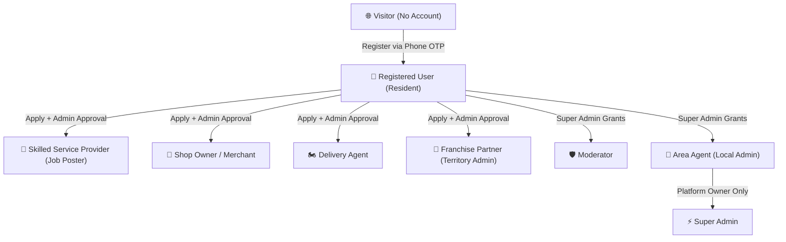
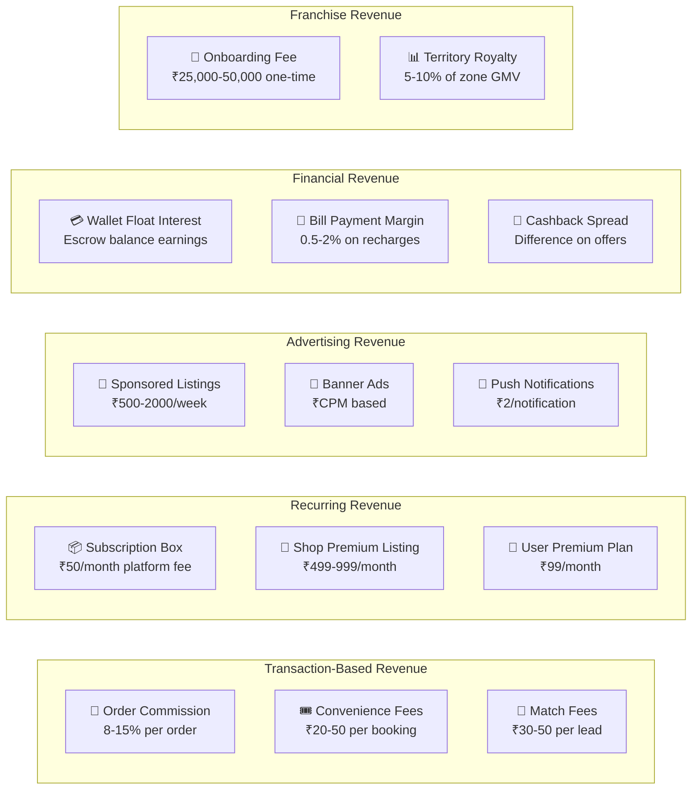

# LocalSampark v4.0 — Complete Super-App Implementation Plan

## 📋 Table of Contents
1. [Auth & RBAC System — Current State Audit](#1-auth--rbac-system--current-state-audit)
2. [Complete User Access Flow Design](#2-complete-user-access-flow-design)
3. [What's Built vs What's Missing](#3-whats-built-vs-whats-missing)
4. [RBAC Implementation Plan](#4-rbac-implementation-plan)
5. [New Job Categories (25 NEW)](#5-new-job-categories-25-new)
6. [New Services to Add (20 NEW)](#6-new-services-to-add-20-new)
7. [Revenue Generation Model](#7-revenue-generation-model)
8. [File Changes Summary](#8-file-changes-summary)
9. [Verification Plan](#9-verification-plan)

---

## 1. Auth & RBAC System — Current State Audit

### ✅ What's ALREADY Built (Backend)

| Component | File | Status |
|-----------|------|--------|
| OTP Send/Verify API | [auth.routes.js](file:///c:/Users/Abhi%20Laptop/Downloads/Local/Local/localsampark/backend/src/routes/auth.routes.js) | ✅ Working — generates 6-digit OTP, stores in-memory, verifies, creates user & wallet |
| JWT Token Generation | [auth.routes.js](file:///c:/Users/Abhi%20Laptop/Downloads/Local/Local/localsampark/backend/src/routes/auth.routes.js#L77-L94) | ✅ Working — accessToken (1d) + refreshToken (7d), includes `role` & `regionId` in payload |
| Token Refresh API | [auth.routes.js](file:///c:/Users/Abhi%20Laptop/Downloads/Local/Local/localsampark/backend/src/routes/auth.routes.js#L100-L128) | ✅ Working — `/refresh-token` endpoint |
| Auth Middleware | [auth.middleware.js](file:///c:/Users/Abhi%20Laptop/Downloads/Local/Local/localsampark/backend/src/middleware/auth.middleware.js) | ✅ Working — `authenticate`, `optionalAuth`, `requireAdmin`, `requireRole(...)` |
| User Profile CRUD | [user.routes.js](file:///c:/Users/Abhi%20Laptop/Downloads/Local/Local/localsampark/backend/src/routes/user.routes.js) | ✅ Working — `/me`, wallet, points, documents |
| Admin Role Check | [admin.routes.js](file:///c:/Users/Abhi%20Laptop/Downloads/Local/Local/localsampark/backend/src/routes/admin.routes.js#L9-L14) | ✅ Working — checks `req.user.role === 'admin' or 'super_admin'` |
| Users DB Table | [init.sqlite.sql](file:///c:/Users/Abhi%20Laptop/Downloads/Local/Local/localsampark/backend/src/migrations/init.sqlite.sql#L16-L30) | ✅ Has `role` column: `user, shop_owner, delivery_agent, moderator, admin, super_admin` |
| Franchise Partners Table | [init.sqlite.sql](file:///c:/Users/Abhi%20Laptop/Downloads/Local/Local/localsampark/backend/src/migrations/init.sqlite.sql#L577-L591) | ✅ Has territory_name, pincode, commission_rate |
| Revenue Transactions | [init.sqlite.sql](file:///c:/Users/Abhi%20Laptop/Downloads/Local/Local/localsampark/backend/src/migrations/init.sqlite.sql#L594-L607) | ✅ Tracks platform_share, franchise_share, agent_share |
| Rate Limiting | [rateLimit.middleware.js](file:///c:/Users/Abhi%20Laptop/Downloads/Local/Local/localsampark/backend/src/middleware/rateLimit.middleware.js) | ✅ Applied to auth routes |

### ❌ What's MISSING (Critical Gaps)

| Gap | Impact | Priority |
|-----|--------|----------|
| **No AuthContext on frontend** | Login page does `alert()` + `window.location` — no real JWT storage, no session state | 🔴 Critical |
| **No ProtectedRoute guard** | ALL pages (wallet, dashboard, CRM, admin) are publicly accessible without login | 🔴 Critical |
| **Login page is dummy** | Phone/OTP form doesn't call backend API — just shows alerts | 🔴 Critical |
| **No `admin_roles` table in DB** | `auth.middleware.js` line 70 queries `admin_roles` table that DOESN'T EXIST in the schema | 🔴 Critical |
| **No role-based UI rendering** | Admin panel has no auth gate — anyone can access `apps/admin` | 🔴 Critical |
| **No registration step** | After OTP verify, new users need a profile form (name, region) — currently skipped on frontend | 🟡 High |
| **No territory-scoped access** | Franchise partners should only see their territory data — no region filtering on frontend | 🟡 High |
| **Admin panel has no login** | `apps/admin` is a standalone Next.js app with zero auth checks | 🔴 Critical |
| **Auth inconsistency** | `auth.routes.js` signs JWT with `{ id, role, regionId }` but `auth.middleware.js` reads `decoded.userId` — field name mismatch | 🔴 Bug |

---

## 2. Complete User Access Flow Design

### Role Hierarchy



### Detailed Role Access Matrix

| Feature / Page | Visitor | Resident | Service Provider | Shop Owner | Delivery Agent | Franchise Partner | Area Agent | Super Admin |
|---|---|---|---|---|---|---|---|---|
| Home / Landing | ✅ | ✅ | ✅ | ✅ | ✅ | ✅ | ✅ | ✅ |
| Browse Jobs | ✅ | ✅ | ✅ | ✅ | ✅ | ✅ | ✅ | ✅ |
| Browse Services | ✅ | ✅ | ✅ | ✅ | ✅ | ✅ | ✅ | ✅ |
| Browse Shops | ✅ | ✅ | ✅ | ✅ | ✅ | ✅ | ✅ | ✅ |
| Login / Register | ✅ | — | — | — | — | — | — | — |
| **Book a Service** | ❌ → Login | ✅ | ✅ | ✅ | ✅ | ✅ | ✅ | ✅ |
| **Place Order** | ❌ → Login | ✅ | ✅ | ✅ | ✅ | ✅ | ✅ | ✅ |
| Dashboard | ❌ | ✅ | ✅ | ✅ | ✅ | ✅ | ✅ | ✅ |
| Wallet | ❌ | ✅ | ✅ | ✅ | ✅ | ✅ | ✅ | ✅ |
| Post Service Listing | ❌ | ❌ | ✅ | ❌ | ❌ | ✅ | ✅ | ✅ |
| Register Shop | ❌ | ❌ | ❌ | ✅ | ❌ | ✅ | ✅ | ✅ |
| Accept Deliveries | ❌ | ❌ | ❌ | ❌ | ✅ | ❌ | ✅ | ✅ |
| Franchise Dashboard | ❌ | ❌ | ❌ | ❌ | ❌ | ✅ (own zone) | ✅ (multi-zone) | ✅ (all) |
| CRM / Leads | ❌ | ❌ | ❌ | ❌ | ❌ | ✅ (own zone) | ✅ | ✅ |
| Admin Panel | ❌ | ❌ | ❌ | ❌ | ❌ | ❌ | ✅ (limited) | ✅ (full) |
| User Management | ❌ | ❌ | ❌ | ❌ | ❌ | ❌ | ✅ (zone) | ✅ (all) |
| Revenue & Commission | ❌ | ❌ | ❌ | ❌ | ❌ | ✅ (own) | ✅ (zone) | ✅ (all) |
| Territory Control | ❌ | ❌ | ❌ | ❌ | ❌ | ❌ | ❌ | ✅ |
| Platform Settings | ❌ | ❌ | ❌ | ❌ | ❌ | ❌ | ❌ | ✅ |

### Complete User Journey Flow

```
┌─────────────────────────────────────────────────────────────┐
│  STEP 1: VISITOR lands on localsampark.in                   │
│  ➤ Can browse: Home, Jobs, Services, Shops, About           │
│  ➤ Clicks "Book Service" or "Hire Now" → Redirected to /login│
└─────────────────┬───────────────────────────────────────────┘
                  ▼
┌─────────────────────────────────────────────────────────────┐
│  STEP 2: PHONE NUMBER ENTRY → /login                        │
│  ➤ User enters +91 XXXXX XXXXX                              │
│  ➤ Frontend calls POST /api/v1/auth/send-otp                │
│  ➤ Backend generates 6-digit OTP, stores with 5-min expiry  │
└─────────────────┬───────────────────────────────────────────┘
                  ▼
┌─────────────────────────────────────────────────────────────┐
│  STEP 3: OTP VERIFICATION                                   │
│  ➤ User enters 6-digit OTP                                  │
│  ➤ Frontend calls POST /api/v1/auth/verify-otp              │
│  ➤ Two outcomes:                                            │
│     A) EXISTING USER → JWT returned → stored in localStorage │
│        → redirect to /dashboard                              │
│     B) NEW USER → {registered: false} → show profile form    │
└──────────┬──────────────────┬───────────────────────────────┘
           ▼                  ▼
┌──────────────────┐  ┌──────────────────────────────────────┐
│ A) EXISTING USER │  │ B) NEW USER — PROFILE REGISTRATION   │
│ → /dashboard     │  │ ➤ Name, Email (optional), Region     │
│                  │  │ ➤ Calls verify-otp again WITH name    │
│                  │  │ ➤ Backend creates user + wallet       │
│                  │  │ ➤ Returns JWT → /dashboard            │
└──────────────────┘  └──────────────────────────────────────┘
                  ▼
┌─────────────────────────────────────────────────────────────┐
│  STEP 4: ROLE ELEVATION (Admin-Controlled)                  │
│  ➤ Default role = "user" (Resident)                         │
│  ➤ User applies to become:                                  │
│     • Service Provider → fills skills form on /jobs#register│
│     • Shop Owner → fills form on /register-shop             │
│     • Delivery Agent → applies via /earn                    │
│     • Franchise Partner → applies via /franchise            │
│  ➤ Admin reviews in Admin Panel → approves/rejects          │
│  ➤ On approval: Backend updates user.role + creates          │
│    admin_roles entry with permissions & region_id            │
└─────────────────────────────────────────────────────────────┘
```

---

## 3. What's Built vs What's Missing

### Frontend (`apps/web`)

| Layer | Built? | Details |
|-------|--------|---------|
| Login UI (phone + OTP) | ✅ Partial | Form exists but uses `alert()` — doesn't call API |
| AuthContext Provider | ❌ Missing | No React context for auth state |
| ProtectedRoute Guard | ❌ Missing | No route protection — all pages public |
| Role-based UI switching | ❌ Missing | No conditional rendering by role |
| Registration Step 2 (profile) | ❌ Missing | No name/region form for new users |
| JWT localStorage handling | ❌ Missing | No token persistence |
| Token refresh logic | ❌ Missing | No auto-refresh before expiry |

### Backend (`backend/src`)

| Layer | Built? | Details |
|-------|--------|---------|
| OTP send/verify | ✅ Complete | In-memory store, 5-min expiry |
| JWT sign + refresh | ✅ Complete | But has field name bug (`id` vs `userId`) |
| `authenticate` middleware | ✅ Complete | Checks Bearer token |
| `requireAdmin` middleware | ⚠️ Buggy | Queries `admin_roles` table that doesn't exist |
| `requireRole(...)` middleware | ✅ Complete | Role-based route guard |
| `admin_roles` DB table | ❌ Missing | Referenced in code but not in schema |
| Franchise auth scoping | ❌ Missing | No territory-level data filtering |
| Service provider role APIs | ❌ Missing | No API to apply/approve provider roles |

### Admin Panel (`apps/admin`)

| Layer | Built? | Details |
|-------|--------|---------|
| Dashboard UI | ✅ Complete | Users, shops, franchise, territory, revenue, settings tabs |
| Role change UI | ✅ Partial | Dropdown exists but uses mock data |
| Auth gate | ❌ Missing | No login required to access admin panel |
| API integration | ❌ Missing | All data is hardcoded MOCK arrays |

---

## 4. RBAC Implementation Plan

### Phase 1: Database Schema Fix

#### [NEW] Migration: `admin_roles` table + user role expansion

Add to [init.sqlite.sql](file:///c:/Users/Abhi%20Laptop/Downloads/Local/Local/localsampark/backend/src/migrations/init.sqlite.sql):

```sql
-- ─── ADMIN ROLES (Multi-role support) ────────────────────────
CREATE TABLE IF NOT EXISTS admin_roles (
    id TEXT PRIMARY KEY,
    user_id TEXT REFERENCES users(id) ON DELETE CASCADE,
    role TEXT NOT NULL,  -- territory_admin, area_agent, moderator, super_admin, service_provider
    region_id TEXT REFERENCES regions(id) ON DELETE SET NULL,
    permissions TEXT DEFAULT '{}',  -- JSON: {"canApproveShops": true, "canManageUsers": true, ...}
    is_active INTEGER DEFAULT 1,
    granted_by TEXT REFERENCES users(id) ON DELETE SET NULL,
    created_at TEXT DEFAULT CURRENT_TIMESTAMP,
    UNIQUE(user_id, role)
);

CREATE INDEX IF NOT EXISTS idx_admin_roles_user ON admin_roles (user_id);
```

Also update users table role comment:
```sql
role TEXT DEFAULT 'user'
-- Allowed: user, shop_owner, delivery_agent, service_provider, moderator, territory_admin, area_agent, super_admin
```

---

### Phase 2: Fix Backend Auth Bug

#### [MODIFY] [auth.routes.js](file:///c:/Users/Abhi%20Laptop/Downloads/Local/Local/localsampark/backend/src/routes/auth.routes.js)
- Fix JWT payload field: change `{ id: user.id, ...}` → `{ userId: user.id, ...}` to match what `auth.middleware.js` expects on `decoded.userId`

#### [MODIFY] [auth.middleware.js](file:///c:/Users/Abhi%20Laptop/Downloads/Local/Local/localsampark/backend/src/middleware/auth.middleware.js)
- Ensure `requireAdmin` gracefully handles missing `admin_roles` table (fallback to `users.role` check)

---

### Phase 3: Frontend Auth System

#### [NEW] [context/AuthContext.js](file:///c:/Users/Abhi%20Laptop/Downloads/Local/Local/localsampark/apps/web/src/context/AuthContext.js)
- React Context wrapping the entire app
- State: `{ user, token, loading, error }`
- Methods: `sendOtp(phone)`, `verifyOtp(phone, otp, fullName?)`, `logout()`, `refreshToken()`
- Auto-loads user from `localStorage` on mount
- Auto-refreshes token before expiry

#### [NEW] [components/ProtectedRoute.js](file:///c:/Users/Abhi%20Laptop/Downloads/Local/Local/localsampark/apps/web/src/app/components/ProtectedRoute.js)
- Client-side wrapper component
- If `user === null` → redirect to `/login`
- Accepts `requiredRoles={['admin', 'territory_admin']}` prop
- If user role not in requiredRoles → redirect to `/dashboard` with toast

#### [MODIFY] [layout.js](file:///c:/Users/Abhi%20Laptop/Downloads/Local/Local/localsampark/apps/web/src/app/layout.js)
- Wrap `{children}` with `<AuthProvider>`
- Add `'use client'` directive (needed for context)

#### [MODIFY] [login/page.js](file:///c:/Users/Abhi%20Laptop/Downloads/Local/Local/localsampark/apps/web/src/app/login/page.js)
- Replace `alert()` calls with actual `sendOtp()` / `verifyOtp()` from AuthContext
- Add Step 3: profile registration form for new users
- Add quick-login presets for dev testing (Login as Admin, Resident, Provider)
- Redirect to `/dashboard` on success

---

## 5. New Job Categories (25 NEW)

> [!IMPORTANT]
> These are 25 **completely new** categories to add alongside the existing 13. Every single one represents a real service people need from their local neighborhood.

#### [MODIFY] [jobs/page.js](file:///c:/Users/Abhi%20Laptop/Downloads/Local/Local/localsampark/apps/web/src/app/jobs/page.js)

**Add to `ALL_PROVIDERS` array and `CATEGORIES` array:**

| # | Category | Icon | Example Skills | Rate Range |
|---|----------|------|---------------|------------|
| 1 | **Painter** | 🎨 | Wall painting, Waterproofing, Texture finish | ₹350/hr |
| 2 | **Welder** | 🔥 | Gate repair, Grille work, Iron fabrication | ₹400/hr |
| 3 | **Mason** | 🧱 | Tile fixing, Wall repair, Bathroom renovation | ₹500/hr |
| 4 | **Tailor / Alteration** | 🧵 | Stitching, Blouse alteration, Curtain making | ₹150/piece |
| 5 | **Photographer** | 📸 | Events, Product shoots, Passport photos | ₹1,500/session |
| 6 | **Mehendi Artist** | 🌿 | Bridal mehendi, Party designs, Arabic patterns | ₹800/session |
| 7 | **Interior Designer** | 🏗️ | Space planning, Modular kitchen, False ceiling | ₹2,000 consultation |
| 8 | **Astrologer / Pandit** | 🕉️ | Puja services, Vastu consultation, Kundli matching | ₹500/session |
| 9 | **Music Teacher** | 🎸 | Guitar, Harmonium, Tabla, Classical vocal | ₹400/hr |
| 10 | **Yoga Instructor** | 🧘 | Morning yoga, Pranayama, Meditation sessions | ₹300/hr |
| 11 | **Fitness Trainer** | 💪 | Home workout, Weight training, Zumba | ₹500/hr |
| 12 | **Watchman / Security** | 🛡️ | Night watch, Event security, Parking guard | ₹600/shift |
| 13 | **Driver on Demand** | 🚗 | Outstation trips, Airport drops, Daily commute | ₹250/hr |
| 14 | **Washing Machine Repair** | 🔧 | Drum fix, Motor repair, Installation | ₹300/visit |
| 15 | **RO Water Purifier Tech** | 💧 | Filter change, AMC service, Installation | ₹250/visit |
| 16 | **Inverter / UPS Tech** | 🔋 | Battery replacement, Wiring, AMC servicing | ₹300/visit |
| 17 | **Computer / Laptop Repair** | 🖥️ | OS install, Data recovery, Hardware repair | ₹400/visit |
| 18 | **Mobile Phone Repair** | 📱 | Screen replacement, Battery change, Software fix | ₹200/visit |
| 19 | **CCTV / Security Install** | 📹 | Camera setup, DVR config, Wi-Fi camera | ₹500/visit |
| 20 | **Packers & Movers** | 📦 | Local shifting, Packing, Furniture disassembly | ₹2,000 base |
| 21 | **Whitewash / Distemper** | 🪣 | Room whitewash, Ceiling painting, POP repair | ₹12/sq.ft |
| 22 | **Garden Landscaper** | 🌳 | Lawn setup, Tree pruning, Irrigation system | ₹500/visit |
| 23 | **Chartered Accountant** | 📊 | ITR filing, GST registration, TDS returns | ₹500/consultation |
| 24 | **Legal Advisor** | ⚖️ | Rental agreement, Notary, Property disputes | ₹1,000/consultation |
| 25 | **Event Decorator** | 🎪 | Birthday decor, Mandap setup, Balloon art | ₹2,500 base |

---

## 6. New Services to Add (20 NEW)

> [!IMPORTANT]
> These 20 services are **completely different** from the 28 already on the services page. Each targets a unique daily-life need.

#### [MODIFY] [services/page.js](file:///c:/Users/Abhi%20Laptop/Downloads/Local/Local/localsampark/apps/web/src/app/services/page.js)

| # | Service | Icon | Description | Rate | Revenue Model |
|---|---------|------|-------------|------|---------------|
| 1 | **Gas Cylinder Booking** | 🔥 | Book Indane/HP/Bharat gas cylinder refills via local distributor | ₹30 booking fee | ₹30 per booking |
| 2 | **Newspaper Subscription** | 📰 | Start/stop/pause daily newspaper delivery (TOI, Sakal, Loksatta) | ₹0 (free listing) | ₹5/month from publisher |
| 3 | **Milk & Dairy Subscription** | 🥛 | Daily milk, curd, paneer from local dairy booth | ₹50/month platform fee | Subscription commission |
| 4 | **Electric Vehicle Charging** | ⚡ | Find and book nearby EV charging points in societies/parking | ₹5/session booking | Per-session booking fee |
| 5 | **Coworking Space Finder** | 🏢 | Book hourly/daily desk space at local cafes or shared offices | ₹99/day | 12% booking commission |
| 6 | **Ration Card & PDS Service** | 🏛️ | Doorstep assistance for ration card application, update, transfer | ₹200 service fee | 15% fee share |
| 7 | **Local Astro / Jyotish** | 🔮 | Book verified local pandits for puja, havan, or vastu consultation | ₹500/session | ₹50 match fee |
| 8 | **Birthday Party Organizer** | 🎂 | End-to-end birthday planning: cake, balloons, photographer, games | ₹3,999 package | 10% commission |
| 9 | **Passport / Visa Assistance** | 🛂 | Help with passport application, appointment, documentation | ₹300 consulting fee | 15% fee share |
| 10 | **Marriage Hall / Venue Booking** | 💒 | Discover and book local banquet halls, lawns, community halls | ₹0 listing fee | 5% booking commission |
| 11 | **Local Courier Pickup** | 🏷️ | Schedule Delhivery/DTDC/BlueDart pickup from your doorstep | ₹20 convenience fee | Per-pickup fee |
| 12 | **Pet Grooming & Vet Visit** | 🐕 | Doorstep pet bathing, nail trimming, vaccination, vet consultation | ₹399/session | 10% commission |
| 13 | **Solar Panel Cleaning** | ☀️ | Professional cleaning of rooftop solar panels for max efficiency | ₹299/visit | 10% commission |
| 14 | **Aquarium & Fish Tank Service** | 🐠 | Tank cleaning, water treatment, fish health checkup | ₹250/visit | ₹30 match fee |
| 15 | **Printing & Stationery** | 🖨️ | Printouts, photocopies, lamination, spiral binding from local shops | ₹10 delivery fee | Per-order delivery fee |
| 16 | **Home Fumigation (Sanitize)** | 🧴 | Full home sanitization and disinfection spray | ₹999/session | 10% commission |
| 17 | **Borewell & Plumbing Contractor** | 🚰 | Borewell drilling, tank cleaning, overhead tank repair | ₹500 base + quote | 8% commission |
| 18 | **Old Age Home Companion Visit** | 👵 | Volunteer or paid companion visits for elderly staying alone | ₹200/hr | ₹30 match fee |
| 19 | **Fire Extinguisher Refill** | 🧯 | AMC refilling and testing of society/home fire extinguishers | ₹350/unit | 10% commission |
| 20 | **Rain Water Harvesting Setup** | 🌧️ | Consultation and installation of rainwater harvesting systems | ₹1,500 consultation | 12% project commission |

---

## 7. Revenue Generation Model

### 💰 Complete Revenue Streams (14 Pillars)



### Detailed Revenue Breakdown Per Service

| Revenue Stream | Source | Per-Transaction | Monthly Estimate (Dhanori Pilot) |
|---|---|---|---|
| **Order Delivery Commission** | Shop orders via platform | 8-15% of order value | ₹85,000 |
| **Service Booking Commission** | All services (laundry, cleaning, etc.) | 10-12% | ₹45,000 |
| **Job Matching Fee** | Each gig worker hire | ₹30-50 flat | ₹15,000 |
| **Emergency Dispatch Premium** | 30-min guaranteed SLA | ₹50-100 per dispatch | ₹8,000 |
| **Subscription Platform Fee** | Milk, water, tiffin subscriptions | ₹50/subscriber/month | ₹12,500 |
| **Bill Payment Convenience Fee** | Electricity, gas, maintenance | ₹10-30 per bill | ₹7,500 |
| **Shop Premium Listing** | Featured placement in directory | ₹499-999/month | ₹12,000 |
| **Sponsored Banner Ads** | Local brands/shops | ₹500-2,000/week | ₹20,000 |
| **Property Listing Fee** | Rental/sale listings | ₹199 per listing | ₹6,000 |
| **Event Ticketing Commission** | Paid local events | 5-8% of ticket price | ₹4,000 |
| **Wallet Float Earnings** | Interest on escrow balance | ~4% annual on float | ₹5,000 |
| **Franchise Onboarding Fee** | New zone partner signup | ₹25,000-50,000 one-time | ₹25,000 (when new zone added) |
| **Territory Royalty** | Ongoing zone revenue share | 5-10% of zone GMV | ₹35,000 |
| **Data Insights (B2B)** | Anonymized neighborhood trends | Monthly subscription | ₹10,000 |
| **TOTAL ESTIMATED** | | | **₹2,90,000/month/zone** |

### Revenue Split Model

| Stakeholder | Share | What They Get |
|---|---|---|
| **Platform (LocalSampark)** | 40% | Technology, servers, support, marketing |
| **Franchise Partner (Territory Admin)** | 30% | On-ground operations, merchant onboarding, local marketing |
| **Service Provider / Delivery Agent** | 20% | Direct earnings from gig work |
| **Reserve Fund + Rewards** | 10% | User cashback, loyalty rewards, emergency fund |

---

## 8. File Changes Summary

### Database Layer
| Action | File | Change |
|--------|------|--------|
| [MODIFY] | [init.sqlite.sql](file:///c:/Users/Abhi%20Laptop/Downloads/Local/Local/localsampark/backend/src/migrations/init.sqlite.sql) | Add `admin_roles` table + index |

### Backend Auth Fix
| Action | File | Change |
|--------|------|--------|
| [MODIFY] | [auth.routes.js](file:///c:/Users/Abhi%20Laptop/Downloads/Local/Local/localsampark/backend/src/routes/auth.routes.js) | Fix JWT payload field name (`id` → `userId`) |
| [MODIFY] | [auth.middleware.js](file:///c:/Users/Abhi%20Laptop/Downloads/Local/Local/localsampark/backend/src/middleware/auth.middleware.js) | Add graceful fallback for `admin_roles` table |

### Frontend Auth System (NEW Files)
| Action | File | Change |
|--------|------|--------|
| [NEW] | `apps/web/src/context/AuthContext.js` | Full auth provider with sendOtp, verifyOtp, logout, auto-refresh |
| [NEW] | `apps/web/src/app/components/ProtectedRoute.js` | Role-gated route wrapper |
| [MODIFY] | [layout.js](file:///c:/Users/Abhi%20Laptop/Downloads/Local/Local/localsampark/apps/web/src/app/layout.js) | Wrap with AuthProvider |
| [MODIFY] | [login/page.js](file:///c:/Users/Abhi%20Laptop/Downloads/Local/Local/localsampark/apps/web/src/app/login/page.js) | Connect to real API + add registration step + dev presets |

### Content Expansion
| Action | File | Change |
|--------|------|--------|
| [MODIFY] | [jobs/page.js](file:///c:/Users/Abhi%20Laptop/Downloads/Local/Local/localsampark/apps/web/src/app/jobs/page.js) | Add 25 new provider entries + 25 new categories |
| [MODIFY] | [services/page.js](file:///c:/Users/Abhi%20Laptop/Downloads/Local/Local/localsampark/apps/web/src/app/services/page.js) | Add 20 new service entries |

---

## 9. Verification Plan

### Automated Tests
```bash
# Build check — all routes must compile
cd apps/web && npx next build

# Backend start check
cd backend && node src/server.js
```

### Manual Verification
- **Auth Flow Test:** Visit `/wallet` without login → must redirect to `/login`
- **OTP Flow:** Enter phone → receive OTP in dev console → verify → land on `/dashboard`
- **New User Flow:** Use new phone → complete profile registration → verify wallet created
- **Role Gate Test:** Login as Resident → try accessing `/crm` → must redirect away
- **Dev Presets:** Click "Login as Admin" → verify full admin access
- **Category Count:** Jobs page must show 38 total categories (13 existing + 25 new)
- **Services Count:** Services page must show 48 total services (28 existing + 20 new)

---

## Open Questions

> [!IMPORTANT]
> **Q1:** Should the admin panel (`apps/admin`) share the same auth system as the main web app, or should it have a separate admin-only login with stricter controls (e.g., IP allowlist, 2FA)?

> [!IMPORTANT]
> **Q2:** For the franchise partner (territory admin) — should they see the admin panel with territory-filtered data, or should they have their own separate dashboard page within `apps/web`?

> [!WARNING]
> **Q3:** The current OTP system stores OTPs in-memory (`Map`). This works for dev but will lose all OTPs on server restart. Should we integrate Redis for OTP storage now, or keep in-memory for the pilot phase?
