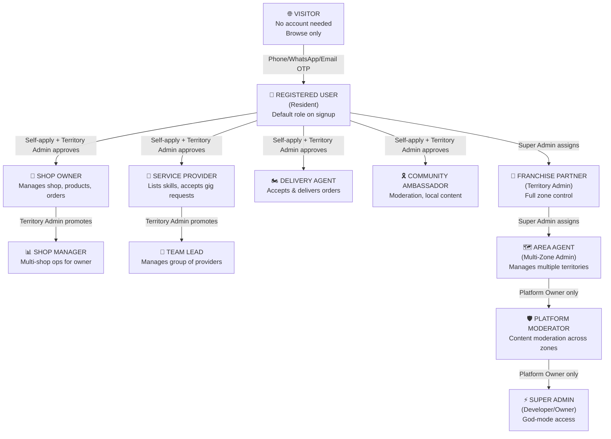

# LocalSampark v4.0 — Production-Grade Super-App Implementation Plan

> **Status:** Updated with user feedback — Awaiting final approval  
> **Target:** Industrial-grade, real-time deployable, revenue-generating platform  
> **Scope:** Web + Mobile Android + Admin Panel + Backend API

---

## 📋 Table of Contents
1. [Complete 12-Role Access System](#1-complete-12-role-access-system)
2. [Triple-Auth System (OTP + WhatsApp + Email)](#2-triple-auth-system)
3. [Separate Admin Login with Strict Controls](#3-separate-admin-login)
4. [Franchise Partner Dashboard](#4-franchise-partner-dashboard)
5. [Detailed Access Matrix (40+ Permissions)](#5-detailed-access-matrix)
6. [New Job Categories (25 NEW)](#6-new-job-categories)
7. [New Services (20 NEW)](#7-new-services)
8. [Updated Revenue Model (50% Platform Share)](#8-updated-revenue-model)
9. [10 Premium Features for Market Competitiveness](#9-premium-features)
10. [Production Deployment Architecture](#10-production-deployment)
11. [Complete File Changes (58 Files)](#11-complete-file-changes)
12. [Verification Plan](#12-verification-plan)

---

## 1. Complete 12-Role Access System

### Role Hierarchy



### Role Definitions

| # | Role ID | Display Name | How to Get | Who Approves | Scope |
|---|---------|-------------|------------|--------------|-------|
| 1 | `visitor` | Visitor | Default (no account) | — | Public pages only |
| 2 | `user` | Registered User / Resident | Phone/WhatsApp/Email OTP signup | Auto on OTP verify | Own profile + booking |
| 3 | `service_provider` | Skilled Service Provider | Apply via /jobs#register | Territory Admin | Own listings + earnings |
| 4 | `shop_owner` | Shop Owner / Merchant | Apply via /register-shop | Territory Admin | Own shop(s) management |
| 5 | `delivery_agent` | Delivery Agent / Runner | Apply via /earn | Territory Admin | Accept deliveries in zone |
| 6 | `community_ambassador` | Community Ambassador | Invitation by Territory Admin | Territory Admin | Moderate posts in zone |
| 7 | `shop_manager` | Shop Manager | Assigned by Shop Owner | Shop Owner + Territory Admin | Manage specific shops |
| 8 | `team_lead` | Service Team Lead | Promoted by Territory Admin | Territory Admin | Manage group of providers |
| 9 | `territory_admin` | Franchise Partner / Territory Admin | Apply via /franchise + pay ₹50,000 | Super Admin only | Full control of 1 zone |
| 10 | `area_agent` | Area Agent (Multi-Zone) | Promoted from Territory Admin | Super Admin only | Manage multiple zones |
| 11 | `moderator` | Platform Moderator | Assigned by Super Admin | Super Admin only | Content moderation all zones |
| 12 | `super_admin` | Super Admin / Developer | Platform owner only | — (seeded in DB) | God-mode everything |

---

## 2. Triple-Auth System

### Authentication Options

```
┌─────────────────────────────────────────────────────────┐
│              LOGIN / REGISTER OPTIONS                    │
├─────────────────────────────────────────────────────────┤
│                                                          │
│  ┌──────────────────┐  ┌──────────────────┐             │
│  │  📱 Phone OTP    │  │  💬 WhatsApp OTP │             │
│  │  +91 XXXXX XXXXX │  │  via WhatsApp    │             │
│  │  (Default)       │  │  Business API    │             │
│  └────────┬─────────┘  └────────┬─────────┘             │
│           │                      │                       │
│           ▼                      ▼                       │
│  ┌──────────────────────────────────────────┐           │
│  │        6-Digit OTP Verification          │           │
│  │  ┌──┐ ┌──┐ ┌──┐ ┌──┐ ┌──┐ ┌──┐        │           │
│  │  │  │ │  │ │  │ │  │ │  │ │  │        │           │
│  │  └──┘ └──┘ └──┘ └──┘ └──┘ └──┘        │           │
│  └──────────────────────────────────────────┘           │
│                                                          │
│  ── OR ──────────────────────────────────────           │
│                                                          │
│  ┌──────────────────────────────────────────┐           │
│  │  📧 Email + Password Login               │           │
│  │  Email:    user@example.com              │           │
│  │  Password: ••••••••                      │           │
│  │  + Email verification link on signup      │           │
│  └──────────────────────────────────────────┘           │
│                                                          │
└─────────────────────────────────────────────────────────┘
```

### Backend Auth Endpoints

| Endpoint | Method | Purpose |
|----------|--------|---------|
| `/api/v1/auth/send-otp` | POST | Send SMS OTP to phone number |
| `/api/v1/auth/send-whatsapp-otp` | POST | **NEW** — Send OTP via WhatsApp Business API |
| `/api/v1/auth/verify-otp` | POST | Verify phone/WhatsApp OTP |
| `/api/v1/auth/register-email` | POST | **NEW** — Register with email + password + send verification email |
| `/api/v1/auth/verify-email` | GET | **NEW** — Verify email via link token |
| `/api/v1/auth/login-email` | POST | **NEW** — Login with email + password |
| `/api/v1/auth/forgot-password` | POST | **NEW** — Send password reset email |
| `/api/v1/auth/reset-password` | POST | **NEW** — Reset password with token |
| `/api/v1/auth/refresh-token` | POST | Refresh JWT access token |
| `/api/v1/auth/logout` | POST | **NEW** — Invalidate refresh token |

### Database Changes for Auth

```sql
-- Update users table to support email auth
ALTER TABLE users ADD COLUMN email_verified INTEGER DEFAULT 0;
ALTER TABLE users ADD COLUMN password_hash TEXT;  -- bcrypt hashed, NULL for OTP-only users
ALTER TABLE users ADD COLUMN whatsapp_number TEXT;
ALTER TABLE users ADD COLUMN auth_method TEXT DEFAULT 'phone_otp';  -- phone_otp, whatsapp_otp, email
ALTER TABLE users ADD COLUMN last_login_at TEXT;
ALTER TABLE users ADD COLUMN login_count INTEGER DEFAULT 0;

-- Email verification tokens
CREATE TABLE IF NOT EXISTS email_verification_tokens (
    id TEXT PRIMARY KEY,
    user_id TEXT REFERENCES users(id) ON DELETE CASCADE,
    token TEXT UNIQUE NOT NULL,
    expires_at TEXT NOT NULL,
    used INTEGER DEFAULT 0,
    created_at TEXT DEFAULT CURRENT_TIMESTAMP
);

-- Password reset tokens
CREATE TABLE IF NOT EXISTS password_reset_tokens (
    id TEXT PRIMARY KEY,
    user_id TEXT REFERENCES users(id) ON DELETE CASCADE,
    token TEXT UNIQUE NOT NULL,
    expires_at TEXT NOT NULL,
    used INTEGER DEFAULT 0,
    created_at TEXT DEFAULT CURRENT_TIMESTAMP
);
```

---

## 3. Separate Admin Login

> [!IMPORTANT]
> The admin panel (`apps/admin`) will have its **own separate login system** with stricter security controls, completely independent from the main user website.

### Admin Security Controls

| Control | Implementation |
|---------|---------------|
| **Separate Login Page** | `/admin/login` with admin-specific credentials |
| **Admin PIN Code** | 6-digit PIN required in addition to phone OTP (2-factor) |
| **IP Allowlist** | Only whitelisted IPs can access admin panel (configurable) |
| **Session Audit Log** | Every admin login/action logged with IP, timestamp, user-agent |
| **Session Timeout** | Auto-logout after 30 minutes of inactivity |
| **Failed Login Lockout** | 5 failed attempts → account locked for 15 minutes |
| **Role Verification** | JWT must contain `role: super_admin` or `role: area_agent` |

### Admin Login Flow

```
┌─────────────────────────────────────────────────┐
│  STEP 1: admin.localsampark.in/login             │
│  ➤ Enter admin phone number                      │
│  ➤ System checks if phone has admin_role entry   │
│  ➤ If NO admin role → "Access Denied"            │
└──────────────────┬──────────────────────────────┘
                   ▼
┌─────────────────────────────────────────────────┐
│  STEP 2: OTP + Admin PIN Verification            │
│  ➤ SMS OTP sent to admin phone                   │
│  ➤ Admin enters OTP + their personal 6-digit PIN │
│  ➤ Both must match → JWT issued with admin scope  │
└──────────────────┬──────────────────────────────┘
                   ▼
┌─────────────────────────────────────────────────┐
│  STEP 3: IP Check + Audit Log                    │
│  ➤ Server checks request IP against allowlist    │
│  ➤ If blocked IP → "Access from this location    │
│    not allowed"                                  │
│  ➤ Login event logged: { admin_id, ip, time,    │
│    user_agent, action: 'login' }                │
└──────────────────┬──────────────────────────────┘
                   ▼
┌─────────────────────────────────────────────────┐
│  STEP 4: Admin Dashboard                         │
│  ➤ Super Admin → Full God-mode access            │
│  ➤ Area Agent → Multi-zone filtered view         │
│  ➤ 30-min session timeout enforced               │
└─────────────────────────────────────────────────┘
```

### New Database Tables for Admin Auth

```sql
-- Admin PIN codes (separate from user password)
CREATE TABLE IF NOT EXISTS admin_pins (
    id TEXT PRIMARY KEY,
    user_id TEXT REFERENCES users(id) ON DELETE CASCADE UNIQUE,
    pin_hash TEXT NOT NULL,  -- bcrypt hashed 6-digit PIN
    failed_attempts INTEGER DEFAULT 0,
    locked_until TEXT,
    created_at TEXT DEFAULT CURRENT_TIMESTAMP
);

-- Admin session audit log
CREATE TABLE IF NOT EXISTS admin_audit_log (
    id TEXT PRIMARY KEY,
    admin_id TEXT REFERENCES users(id) ON DELETE SET NULL,
    action TEXT NOT NULL,  -- login, logout, approve_shop, change_role, etc.
    target_type TEXT,      -- user, shop, franchise, territory
    target_id TEXT,
    ip_address TEXT NOT NULL,
    user_agent TEXT,
    details TEXT,           -- JSON with action-specific data
    created_at TEXT DEFAULT CURRENT_TIMESTAMP
);

-- IP allowlist for admin access
CREATE TABLE IF NOT EXISTS admin_ip_allowlist (
    id TEXT PRIMARY KEY,
    ip_address TEXT NOT NULL,
    label TEXT,            -- "Office IP", "Home IP", etc.
    added_by TEXT REFERENCES users(id),
    is_active INTEGER DEFAULT 1,
    created_at TEXT DEFAULT CURRENT_TIMESTAMP
);

-- Admin roles (multi-role, region-scoped)
CREATE TABLE IF NOT EXISTS admin_roles (
    id TEXT PRIMARY KEY,
    user_id TEXT REFERENCES users(id) ON DELETE CASCADE,
    role TEXT NOT NULL,
    region_id TEXT REFERENCES regions(id) ON DELETE SET NULL,
    permissions TEXT DEFAULT '{}',
    is_active INTEGER DEFAULT 1,
    granted_by TEXT REFERENCES users(id) ON DELETE SET NULL,
    created_at TEXT DEFAULT CURRENT_TIMESTAMP,
    UNIQUE(user_id, role)
);
```

---

## 4. Franchise Partner Dashboard

> [!IMPORTANT]
> Franchise Partners (Territory Admins) get their **own dashboard within `apps/web`** at `/franchise/dashboard` — NOT the admin panel. They see only their zone's data.

### Franchise Dashboard Pages

| Route | Page | What They See |
|-------|------|---------------|
| `/franchise/dashboard` | Overview | Zone stats, revenue summary, pending approvals count |
| `/franchise/approvals` | **NEW** — Approvals Queue | Pending shop registrations, provider applications, property listings — **APPROVE/REJECT** |
| `/franchise/users` | **NEW** — Zone Users | All users in their pincode/zone — can assign roles |
| `/franchise/shops` | **NEW** — Zone Shops | All shops in their territory — manage, flag, feature |
| `/franchise/providers` | **NEW** — Zone Providers | All service providers — verify, assign, manage |
| `/franchise/revenue` | **NEW** — Zone Revenue | Revenue breakdown, commission earned, payout history |
| `/franchise/agents` | **NEW** — Delivery Agents | Online/offline status, performance, assignments |
| `/franchise/posts` | **NEW** — Content Management | Approve/reject community posts, assign sticky posts |
| `/franchise/settings` | **NEW** — Zone Settings | Delivery radius, commission rates, operating hours |

### Territory Admin Powers

| Action | Territory Admin Can Do? | Super Admin Can Do? |
|--------|------------------------|---------------------|
| Approve new shop registrations in their zone | ✅ YES | ✅ YES (any zone) |
| Approve service provider applications in their zone | ✅ YES | ✅ YES (any zone) |
| Approve property listings in their zone | ✅ YES | ✅ YES (any zone) |
| Change user roles (user → provider, agent) in their zone | ✅ YES | ✅ YES (any zone) |
| Approve/reject community posts in their zone | ✅ YES | ✅ YES (any zone) |
| Assign sticky/featured posts in their zone | ✅ YES | ✅ YES (any zone) |
| View revenue & commission for their zone | ✅ YES (own zone only) | ✅ YES (all zones) |
| Manage delivery agents in their zone | ✅ YES | ✅ YES (any zone) |
| Set zone-specific commission rates | ✅ YES (within limits) | ✅ YES (override any) |
| Create new territory/zone | ❌ NO | ✅ YES |
| Assign new territory admin | ❌ NO | ✅ YES |
| Delete zones or merge territories | ❌ NO | ✅ YES |
| Access other zones' data | ❌ NO | ✅ YES |
| Modify global platform settings | ❌ NO | ✅ YES |
| View/export all-zone revenue | ❌ NO | ✅ YES |
| Manage admin IP allowlist | ❌ NO | ✅ YES |

---

## 5. Detailed Access Matrix (40+ Permissions)

### Page-Level Access

| Page / Route | Visitor | User | Provider | Shop Owner | Agent | Ambassador | Territory Admin | Area Agent | Moderator | Super Admin |
|---|---|---|---|---|---|---|---|---|---|---|
| `/` Home | ✅ | ✅ | ✅ | ✅ | ✅ | ✅ | ✅ | ✅ | ✅ | ✅ |
| `/about` | ✅ | ✅ | ✅ | ✅ | ✅ | ✅ | ✅ | ✅ | ✅ | ✅ |
| `/jobs` Browse | ✅ | ✅ | ✅ | ✅ | ✅ | ✅ | ✅ | ✅ | ✅ | ✅ |
| `/services` Browse | ✅ | ✅ | ✅ | ✅ | ✅ | ✅ | ✅ | ✅ | ✅ | ✅ |
| `/shops` Browse | ✅ | ✅ | ✅ | ✅ | ✅ | ✅ | ✅ | ✅ | ✅ | ✅ |
| `/properties` Browse | ✅ | ✅ | ✅ | ✅ | ✅ | ✅ | ✅ | ✅ | ✅ | ✅ |
| `/events` Browse | ✅ | ✅ | ✅ | ✅ | ✅ | ✅ | ✅ | ✅ | ✅ | ✅ |
| `/health` Browse | ✅ | ✅ | ✅ | ✅ | ✅ | ✅ | ✅ | ✅ | ✅ | ✅ |
| `/community` Browse | ✅ | ✅ | ✅ | ✅ | ✅ | ✅ | ✅ | ✅ | ✅ | ✅ |
| `/login` | ✅ | — | — | — | — | — | — | — | — | — |
| `/download` | ✅ | ✅ | ✅ | ✅ | ✅ | ✅ | ✅ | ✅ | ✅ | ✅ |
| `/franchise` Info | ✅ | ✅ | ✅ | ✅ | ✅ | ✅ | ✅ | ✅ | ✅ | ✅ |

### Action-Level Access (Requires Login)

| Action | User | Provider | Shop Owner | Agent | Ambassador | Territory Admin | Area Agent | Moderator | Super Admin |
|---|---|---|---|---|---|---|---|---|---|
| **Book a service** | ✅ | ✅ | ✅ | ✅ | ✅ | ✅ | ✅ | ✅ | ✅ |
| **Place shop order** | ✅ | ✅ | ✅ | ✅ | ✅ | ✅ | ✅ | ✅ | ✅ |
| **Post in community** | ✅ | ✅ | ✅ | ✅ | ✅ | ✅ | ✅ | ✅ | ✅ |
| **List property** | ✅ | ✅ | ✅ | ❌ | ✅ | ✅ | ✅ | ✅ | ✅ |
| **Create event** | ✅ | ✅ | ✅ | ❌ | ✅ | ✅ | ✅ | ✅ | ✅ |
| **Post in marketplace** | ✅ | ✅ | ✅ | ✅ | ✅ | ✅ | ✅ | ✅ | ✅ |
| **Offer carpool ride** | ✅ | ✅ | ✅ | ✅ | ✅ | ✅ | ✅ | ✅ | ✅ |

### Protected Pages (Login Required)

| Page / Route | User | Provider | Shop Owner | Agent | Ambassador | Territory Admin | Area Agent | Moderator | Super Admin |
|---|---|---|---|---|---|---|---|---|---|
| `/dashboard` | ✅ own | ✅ own | ✅ own | ✅ own | ✅ own | ✅ own | ✅ own | ✅ own | ✅ own |
| `/wallet` | ✅ own | ✅ own | ✅ own | ✅ own | ✅ own | ✅ own | ✅ own | ✅ own | ✅ own |
| `/subscriptions` | ✅ own | ✅ own | ✅ own | ✅ own | ✅ own | ✅ own | ✅ own | ✅ own | ✅ own |
| `/bills` | ✅ own | ✅ own | ✅ own | ✅ own | ✅ own | ✅ own | ✅ own | ✅ own | ✅ own |
| `/society` | ✅ own | ✅ own | ✅ own | ✅ own | ✅ own | ✅ own | ✅ own | ✅ own | ✅ own |
| `/pets` | ✅ own | ✅ own | ✅ own | ✅ own | ✅ own | ✅ own | ✅ own | ✅ own | ✅ own |
| `/marketplace` Post | ✅ | ✅ | ✅ | ✅ | ✅ | ✅ | ✅ | ✅ | ✅ |
| `/carpool` | ✅ | ✅ | ✅ | ✅ | ✅ | ✅ | ✅ | ✅ | ✅ |

### Role-Specific Pages

| Page / Route | Provider | Shop Owner | Agent | Ambassador | Territory Admin | Area Agent | Moderator | Super Admin |
|---|---|---|---|---|---|---|---|---|
| `/jobs#register` Apply | ✅ post listing | ❌ | ❌ | ❌ | ✅ manage | ✅ manage | ❌ | ✅ manage |
| `/register-shop` | ❌ | ✅ register | ❌ | ❌ | ✅ manage | ✅ manage | ❌ | ✅ manage |
| `/earn` Agent Dashboard | ❌ | ❌ | ✅ own | ❌ | ✅ manage | ✅ manage | ❌ | ✅ manage |
| `/franchise/dashboard` | ❌ | ❌ | ❌ | ❌ | ✅ own zone | ✅ multi-zone | ❌ | ✅ all zones |
| `/franchise/approvals` | ❌ | ❌ | ❌ | ❌ | ✅ own zone | ✅ multi-zone | ❌ | ✅ all zones |
| `/franchise/users` | ❌ | ❌ | ❌ | ❌ | ✅ own zone | ✅ multi-zone | ❌ | ✅ all zones |
| `/franchise/revenue` | ❌ | ❌ | ❌ | ❌ | ✅ own zone | ✅ multi-zone | ❌ | ✅ all zones |
| `/franchise/posts` | ❌ | ❌ | ❌ | ✅ own zone | ✅ own zone | ✅ multi-zone | ✅ all | ✅ all |
| `/crm/*` | ❌ | ❌ | ❌ | ❌ | ✅ own zone | ✅ multi-zone | ❌ | ✅ all zones |

### Admin Panel Access (Separate Login)

| Feature | Territory Admin | Area Agent | Moderator | Super Admin |
|---|---|---|---|---|
| Admin Panel Login | ❌ (uses franchise dashboard) | ✅ | ❌ | ✅ |
| View dashboard stats | — | ✅ zones | — | ✅ all |
| User management | — | ✅ zones | — | ✅ all |
| Shop approvals | — | ✅ zones | — | ✅ all |
| Revenue & commission | — | ✅ zones | — | ✅ all |
| Territory control | — | ❌ | — | ✅ |
| Create new territory | — | ❌ | — | ✅ |
| Assign territory admin | — | ❌ | — | ✅ |
| Platform settings | — | ❌ | — | ✅ |
| Modify global commission | — | ❌ | — | ✅ |
| View audit logs | — | ✅ own | — | ✅ all |
| IP allowlist management | — | ❌ | — | ✅ |

---

## 6. New Job Categories (25 NEW)

#### [MODIFY] [jobs/page.js](file:///c:/Users/Abhi%20Laptop/Downloads/Local/Local/localsampark/apps/web/src/app/jobs/page.js)

| # | Category | Icon | Skills | Rate |
|---|----------|------|--------|------|
| 1 | Painter | 🎨 | Wall painting, Waterproofing, Texture finish | ₹350/hr |
| 2 | Welder | 🔥 | Gate repair, Grille work, Iron fabrication | ₹400/hr |
| 3 | Mason | 🧱 | Tile fixing, Wall repair, Bathroom renovation | ₹500/hr |
| 4 | Tailor / Alteration | 🧵 | Stitching, Blouse alteration, Curtain making | ₹150/piece |
| 5 | Photographer | 📸 | Events, Product shoots, Passport photos | ₹1,500/session |
| 6 | Mehendi Artist | 🌿 | Bridal mehendi, Party designs, Arabic patterns | ₹800/session |
| 7 | Interior Designer | 🏗️ | Space planning, Modular kitchen, False ceiling | ₹2,000 consultation |
| 8 | Astrologer / Pandit | 🕉️ | Puja services, Vastu, Kundli matching | ₹500/session |
| 9 | Music Teacher | 🎸 | Guitar, Harmonium, Tabla, Classical vocal | ₹400/hr |
| 10 | Yoga Instructor | 🧘 | Morning yoga, Pranayama, Meditation | ₹300/hr |
| 11 | Fitness Trainer | 💪 | Home workout, Weight training, Zumba | ₹500/hr |
| 12 | Watchman / Security | 🛡️ | Night watch, Event security, Parking | ₹600/shift |
| 13 | Driver on Demand | 🚗 | Outstation, Airport drops, Daily commute | ₹250/hr |
| 14 | Washing Machine Repair | 🔧 | Drum fix, Motor repair, Installation | ₹300/visit |
| 15 | RO Water Purifier Tech | 💧 | Filter change, AMC, Installation | ₹250/visit |
| 16 | Inverter / UPS Tech | 🔋 | Battery replacement, Wiring, AMC | ₹300/visit |
| 17 | Computer / Laptop Repair | 🖥️ | OS install, Data recovery, Hardware | ₹400/visit |
| 18 | Mobile Phone Repair | 📱 | Screen replacement, Battery, Software fix | ₹200/visit |
| 19 | CCTV / Security Install | 📹 | Camera setup, DVR config, Wi-Fi camera | ₹500/visit |
| 20 | Packers & Movers | 📦 | Local shifting, Packing, Disassembly | ₹2,000 base |
| 21 | Whitewash / Distemper | 🪣 | Room whitewash, Ceiling painting, POP | ₹12/sq.ft |
| 22 | Garden Landscaper | 🌳 | Lawn setup, Tree pruning, Irrigation | ₹500/visit |
| 23 | Chartered Accountant | 📊 | ITR filing, GST, TDS returns | ₹500/consultation |
| 24 | Legal Advisor | ⚖️ | Rental agreement, Notary, Property disputes | ₹1,000/consultation |
| 25 | Event Decorator | 🎪 | Birthday decor, Mandap, Balloon art | ₹2,500 base |

---

## 7. New Services (20 NEW)

#### [MODIFY] [services/page.js](file:///c:/Users/Abhi%20Laptop/Downloads/Local/Local/localsampark/apps/web/src/app/services/page.js)

| # | Service | Icon | Description | Rate | Revenue |
|---|---------|------|-------------|------|---------|
| 1 | Gas Cylinder Booking | 🔥 | Indane/HP/Bharat gas refill | ₹30 booking fee | ₹30/booking |
| 2 | Newspaper Subscription | 📰 | Start/stop daily newspaper | Free listing | ₹5/month from publisher |
| 3 | Milk & Dairy Subscription | 🥛 | Daily milk, curd, paneer | ₹50/month | Subscription commission |
| 4 | EV Charging Locator | ⚡ | Find & book nearby EV charging | ₹5/session | Per-session fee |
| 5 | Coworking Space | 🏢 | Hourly/daily desk booking | ₹99/day | 12% commission |
| 6 | Ration Card Service | 🏛️ | Application, update, transfer | ₹200 fee | 15% fee share |
| 7 | Local Jyotish / Pandit | 🔮 | Puja, havan, vastu consultation | ₹500/session | ₹50 match fee |
| 8 | Birthday Party Planner | 🎂 | End-to-end birthday planning | ₹3,999 package | 10% commission |
| 9 | Passport / Visa Help | 🛂 | Application, appointment, docs | ₹300 consulting | 15% fee share |
| 10 | Marriage Venue Booking | 💒 | Banquet halls, lawns, halls | Free listing | 5% booking commission |
| 11 | Local Courier Pickup | 🏷️ | Delhivery/DTDC doorstep pickup | ₹20 convenience | Per-pickup fee |
| 12 | Pet Grooming & Vet | 🐕 | Bathing, trimming, vet visit | ₹399/session | 10% commission |
| 13 | Solar Panel Cleaning | ☀️ | Rooftop panel cleaning | ₹299/visit | 10% commission |
| 14 | Aquarium Service | 🐠 | Tank cleaning, water treatment | ₹250/visit | ₹30 match fee |
| 15 | Printing & Stationery | 🖨️ | Printouts, lamination, binding | ₹10 delivery | Per-order fee |
| 16 | Home Fumigation | 🧴 | Full home sanitization spray | ₹999/session | 10% commission |
| 17 | Borewell & Tank Repair | 🚰 | Drilling, tank cleaning | ₹500 base | 8% commission |
| 18 | Elder Companion Visit | 👵 | Companion visits for elderly | ₹200/hr | ₹30 match fee |
| 19 | Fire Extinguisher Refill | 🧯 | AMC refilling and testing | ₹350/unit | 10% commission |
| 20 | Rainwater Harvesting | 🌧️ | Consultation + installation | ₹1,500 consultation | 12% commission |

---

## 8. Updated Revenue Model (50% Platform Share)

### Revenue Split Model (Updated)

| Stakeholder | Share | Monthly Estimate (Per Zone) |
|---|---|---|
| **🏗️ Platform Owner (LocalSampark Developer)** | **50%** | **₹1,62,500** |
| **🤝 Franchise Partner (Territory Admin)** | **25%** | **₹81,250** |
| **🏍️ Service Providers / Delivery Agents** | **15%** | **₹48,750** |
| **🎁 Reserve Fund + User Rewards** | **10%** | **₹32,500** |
| **TOTAL Per Zone** | **100%** | **₹3,25,000/month** |

### Revenue Streams (16 Pillars)

| # | Revenue Stream | Per Transaction | Monthly/Zone |
|---|---------------|-----------------|--------------|
| 1 | Order delivery commission | 8-15% of order | ₹85,000 |
| 2 | Service booking commission | 10-12% | ₹45,000 |
| 3 | Job matching fee | ₹30-50 per hire | ₹15,000 |
| 4 | Emergency dispatch premium | ₹50-100 per dispatch | ₹8,000 |
| 5 | Subscription platform fee | ₹50/subscriber/month | ₹12,500 |
| 6 | Bill payment convenience fee | ₹10-30 per bill | ₹7,500 |
| 7 | Shop premium listing | ₹499-999/month | ₹12,000 |
| 8 | Sponsored banner ads | ₹500-2,000/week | ₹20,000 |
| 9 | Property listing fee | ₹199 per listing | ₹6,000 |
| 10 | Event ticketing commission | 5-8% of ticket | ₹4,000 |
| 11 | Wallet float interest | ~4% annual on float | ₹5,000 |
| 12 | **Franchise onboarding fee** | **₹50,000 one-time** | ₹50,000 (when new zone) |
| 13 | Territory royalty | 5-10% of zone GMV | ₹35,000 |
| 14 | Data insights (B2B) | Monthly subscription | ₹10,000 |
| 15 | WhatsApp Business API | Per-message revenue share | ₹5,000 |
| 16 | User premium membership (SamparkPlus) | ₹99/month | ₹5,000 |

---

## 9. Premium Features for Market Competitiveness

> [!TIP]
> These 10 features will make LocalSampark stand out against competitors like UrbanClap, Dunzo, and NoBroker.

| # | Feature | Page | Description | Revenue Impact |
|---|---------|------|-------------|---------------|
| 1 | **SamparkPlus Premium** | `/premium` NEW | ₹99/month user plan: Zero delivery fee, priority support, exclusive deals | Recurring revenue |
| 2 | **Live Order Tracking** | `/dashboard` | Real-time GPS tracking of delivery agents on map | User retention |
| 3 | **In-App Chat** | `/chat` NEW | WhatsApp-like chat between user ↔ provider ↔ shop | Engagement |
| 4 | **Service Ratings & Reviews** | `/services`, `/jobs` | 5-star review system with photos for every provider | Trust building |
| 5 | **Referral Rewards Engine** | `/dashboard` | "Refer a neighbor, both get ₹50 wallet credit" | Growth engine |
| 6 | **Schedule Booking Calendar** | All service pages | Pick date + time slot for service booking | Convenience |
| 7 | **Multi-language Support** | Global | Hindi, Marathi, English toggle | Accessibility |
| 8 | **Emergency SOS Button** | `/dashboard` | One-tap emergency: Police, Ambulance, Fire nearest contacts | Safety feature |
| 9 | **Digital Notice Board** | `/society` | Society-level announcements, maintenance reminders, AGM notices | Society engagement |
| 10 | **Loyalty Leaderboard** | `/dashboard` | Gamified points system: Most active neighbor wins monthly prizes | Gamification |

---

## 10. Production Deployment Architecture

### Infrastructure Stack

```
┌─────────────────────────────────────────────────────┐
│                    CLOUDFLARE                         │
│         DNS + CDN + DDoS Protection + WAF            │
│    localsampark.in → Vercel (Web)                    │
│    admin.localsampark.in → Vercel (Admin)             │
│    api.localsampark.in → Railway (Backend)            │
└───────────────────────┬─────────────────────────────┘
                        │
        ┌───────────────┼───────────────┐
        ▼               ▼               ▼
┌──────────────┐ ┌──────────────┐ ┌──────────────┐
│  VERCEL      │ │  VERCEL      │ │  RAILWAY     │
│  apps/web    │ │  apps/admin  │ │  backend     │
│  Next.js SSR │ │  Next.js SSR │ │  Express.js  │
│  Port 3000   │ │  Port 3001   │ │  Port 5000   │
└──────────────┘ └──────────────┘ └──────┬───────┘
                                         │
                    ┌────────────────────┼────────────┐
                    ▼                    ▼            ▼
            ┌──────────────┐   ┌──────────────┐  ┌──────┐
            │  SUPABASE    │   │  REDIS       │  │ S3   │
            │  PostgreSQL  │   │  (Upstash)   │  │ MinIO│
            │  Production  │   │  OTP Cache   │  │ Files│
            │  Database    │   │  Sessions    │  │      │
            └──────────────┘   └──────────────┘  └──────┘

┌─────────────────────────────────────────────────────┐
│                   MOBILE APP                         │
│    React Native → Play Store (Android APK)           │
│    Communicates with api.localsampark.in              │
└─────────────────────────────────────────────────────┘
```

### External Services

| Service | Purpose | Cost |
|---------|---------|------|
| **Cloudflare** | DNS + CDN + SSL + WAF | Free plan |
| **Vercel** | Web + Admin hosting | Free → Pro ₹1,500/mo |
| **Railway** | Backend hosting | ₹500/month |
| **Supabase** | PostgreSQL database | Free → Pro ₹2,000/mo |
| **Upstash Redis** | OTP cache + sessions | Free → ₹500/mo |
| **MSG91 / 2Factor** | SMS OTP delivery | ₹1/SMS |
| **WhatsApp Business API** | WhatsApp OTP | ₹0.50/message |
| **Resend / Mailgun** | Email delivery | Free → ₹800/mo |
| **Razorpay** | Payment gateway | 2% per transaction |
| **Firebase** | Push notifications + Analytics | Free |
| **MinIO / Cloudflare R2** | File storage (images, docs) | ₹200/mo |

---

## 11. Complete File Changes (58 Files)

### Phase 1: Database Schema (3 files)

| Action | File | Change |
|--------|------|--------|
| [MODIFY] | [init.sqlite.sql](file:///c:/Users/Abhi%20Laptop/Downloads/Local/Local/localsampark/backend/src/migrations/init.sqlite.sql) | Add `admin_roles`, `admin_pins`, `admin_audit_log`, `admin_ip_allowlist`, `email_verification_tokens`, `password_reset_tokens` tables |
| [NEW] | `backend/src/migrations/002_auth_upgrade.sql` | Migration script for auth tables |
| [MODIFY] | [database.js](file:///c:/Users/Abhi%20Laptop/Downloads/Local/Local/localsampark/backend/src/config/database.js) | Add migration runner |

---

### Phase 2: Backend Auth System (8 files)

| Action | File | Change |
|--------|------|--------|
| [MODIFY] | [auth.routes.js](file:///c:/Users/Abhi%20Laptop/Downloads/Local/Local/localsampark/backend/src/routes/auth.routes.js) | Fix JWT bug, add WhatsApp OTP, email register/login/verify/forgot/reset endpoints |
| [MODIFY] | [auth.middleware.js](file:///c:/Users/Abhi%20Laptop/Downloads/Local/Local/localsampark/backend/src/middleware/auth.middleware.js) | Fix `requireAdmin` to use `admin_roles` table, add `requireTerritory`, `requireAreaAgent` |
| [NEW] | `backend/src/routes/admin-auth.routes.js` | Separate admin login with PIN + OTP + IP check |
| [NEW] | `backend/src/middleware/adminAuth.middleware.js` | Admin-specific auth with IP allowlist, session audit |
| [NEW] | `backend/src/routes/territory.routes.js` | Territory admin APIs: approvals, user management, revenue |
| [MODIFY] | [admin.routes.js](file:///c:/Users/Abhi%20Laptop/Downloads/Local/Local/localsampark/backend/src/routes/admin.routes.js) | Add territory assignment, admin role management |
| [MODIFY] | [server.js](file:///c:/Users/Abhi%20Laptop/Downloads/Local/Local/localsampark/backend/src/server.js) | Mount new routes |
| [MODIFY] | [.env](file:///c:/Users/Abhi%20Laptop/Downloads/Local/Local/localsampark/backend/.env) | Add WhatsApp API key, email SMTP, admin PIN salt |

---

### Phase 3: Frontend Auth System (6 files)

| Action | File | Change |
|--------|------|--------|
| [NEW] | `apps/web/src/context/AuthContext.js` | Full auth provider (OTP + WhatsApp + email) |
| [NEW] | `apps/web/src/app/components/ProtectedRoute.js` | Role-gated route wrapper |
| [MODIFY] | [layout.js](file:///c:/Users/Abhi%20Laptop/Downloads/Local/Local/localsampark/apps/web/src/app/layout.js) | Wrap with `<AuthProvider>` |
| [MODIFY] | [login/page.js](file:///c:/Users/Abhi%20Laptop/Downloads/Local/Local/localsampark/apps/web/src/app/login/page.js) | Complete redesign: 3 auth methods, profile registration, dev presets |
| [NEW] | `apps/web/src/app/register/page.js` | Dedicated registration page with email + phone |
| [NEW] | `apps/web/src/app/forgot-password/page.js` | Password reset flow |

---

### Phase 4: Franchise Partner Dashboard (10 files)

| Action | File | Change |
|--------|------|--------|
| [MODIFY] | [franchise/page.js](file:///c:/Users/Abhi%20Laptop/Downloads/Local/Local/localsampark/apps/web/src/app/franchise/page.js) | Add login-required redirect for dashboard access |
| [NEW] | `apps/web/src/app/franchise/dashboard/page.js` | Territory Admin overview dashboard |
| [NEW] | `apps/web/src/app/franchise/approvals/page.js` | Pending approvals queue (shops, providers, properties) |
| [NEW] | `apps/web/src/app/franchise/users/page.js` | Zone user management with role assignment |
| [NEW] | `apps/web/src/app/franchise/shops/page.js` | Zone shop management |
| [NEW] | `apps/web/src/app/franchise/providers/page.js` | Zone service providers management |
| [NEW] | `apps/web/src/app/franchise/revenue/page.js` | Zone revenue & commission tracking |
| [NEW] | `apps/web/src/app/franchise/agents/page.js` | Delivery agent management |
| [NEW] | `apps/web/src/app/franchise/posts/page.js` | Community post moderation |
| [NEW] | `apps/web/src/app/franchise/settings/page.js` | Zone configuration |

---

### Phase 5: Content Expansion (4 files)

| Action | File | Change |
|--------|------|--------|
| [MODIFY] | [jobs/page.js](file:///c:/Users/Abhi%20Laptop/Downloads/Local/Local/localsampark/apps/web/src/app/jobs/page.js) | Add 25 new providers + categories |
| [MODIFY] | [services/page.js](file:///c:/Users/Abhi%20Laptop/Downloads/Local/Local/localsampark/apps/web/src/app/services/page.js) | Add 20 new services |
| [MODIFY] | [Header.js](file:///c:/Users/Abhi%20Laptop/Downloads/Local/Local/localsampark/apps/web/src/app/components/Header.js) | Add Franchise Dashboard link for territory admins |
| [MODIFY] | [page.js](file:///c:/Users/Abhi%20Laptop/Downloads/Local/Local/localsampark/apps/web/src/app/page.js) | Update stats, add new service icons to homepage |

---

### Phase 6: Admin Panel Upgrade (6 files)

| Action | File | Change |
|--------|------|--------|
| [MODIFY] | [admin/page.js](file:///c:/Users/Abhi%20Laptop/Downloads/Local/Local/localsampark/apps/admin/src/app/page.js) | Add admin login gate, territory assignment UI, audit log viewer |
| [NEW] | `apps/admin/src/app/login/page.js` | Separate admin login (phone OTP + PIN) |
| [NEW] | `apps/admin/src/context/AdminAuthContext.js` | Admin-specific auth context |
| [MODIFY] | `apps/admin/src/app/layout.js` | Wrap with AdminAuthProvider |
| [NEW] | `apps/admin/src/app/territories/page.js` | Territory management + admin assignment |
| [NEW] | `apps/admin/src/app/audit/page.js` | Admin action audit log viewer |

---

### Premium Features (10+ files)

| Action | File | Change |
|--------|------|--------|
| [NEW] | `apps/web/src/app/premium/page.js` | SamparkPlus subscription page |
| [NEW] | `apps/web/src/app/chat/page.js` | In-app messaging |
| [NEW] | `apps/web/src/app/referral/page.js` | Referral rewards dashboard |
| [MODIFY] | Various service pages | Add ratings/reviews, schedule calendar |

---

## 12. Verification Plan

### Automated Tests
```bash
# Full build verification
cd apps/web && npx next build       # All ~50 routes must compile
cd apps/admin && npx next build     # Admin routes must compile
cd backend && node src/server.js    # Server must start without errors
```

### Auth Flow Tests
- [ ] Visit `/wallet` without login → redirects to `/login`
- [ ] Phone OTP: Enter phone → receive OTP → verify → land on `/dashboard`
- [ ] WhatsApp OTP: Select WhatsApp → receive OTP → verify → land on `/dashboard`
- [ ] Email login: Register with email → verify via link → login with password
- [ ] New user: Complete profile registration → wallet auto-created
- [ ] Role gate: Login as Resident → try `/franchise/dashboard` → redirected
- [ ] Territory admin: Login as territory_admin → see only own zone data
- [ ] Admin panel: Access admin.localsampark.in → separate login → OTP + PIN
- [ ] Dev presets: Quick-login buttons work for all role types

### Content Verification
- [ ] Jobs page shows 38 categories (13 existing + 25 new)
- [ ] Services page shows 48 services (28 existing + 20 new)
- [ ] Franchise dashboard shows 9 sub-pages
- [ ] Revenue split shows 50/25/15/10

### Production Readiness
- [ ] All environment variables documented in `.env.example`
- [ ] Database migration runs without errors
- [ ] Mobile app builds APK successfully
- [ ] Cloudflare DNS configured
- [ ] SSL certificates active
