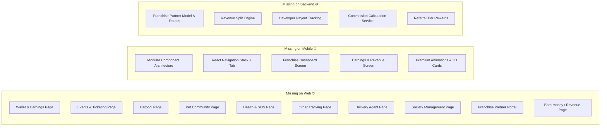
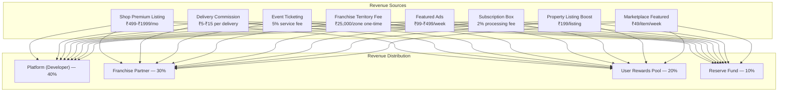

# LocalSampark — Complete Transformation Implementation Plan

> **Goal**: Transform LocalSampark from a basic prototype into a premium, production-grade hyper-local super-app with advanced UI/UX (3D effects, glassmorphism, micro-animations), full feature-parity between Web and Mobile (replica design), and a comprehensive monetization engine for Users, Developers, Visitors, and Franchise Partners — ready for large-scale Pune pilot launch.

---

## Full Codebase Review Summary

After reviewing **every file** in the repository, here is the current state:

### What Exists Today

| Component | Files | Current State |
|:---|:---|:---|
| **Web App** (`apps/web`) | 8 pages, 2 components, 1 CSS | Static hardcoded data, no API integration, emoji placeholders instead of images, basic glassmorphism |
| **Mobile App** (`apps/mobile`) | **Single monolithic file** `App.js` (1,560 lines, 75KB) | 18 screens via state switch, mock data, basic styling, no React Navigation |
| **Admin Panel** (`apps/admin`) | 1 page | Dashboard tab works; all other 9 tabs show "🛠️ stub" placeholder |
| **Backend** (`backend`) | 21 route files, 30+ DB tables, Socket.io, BullMQ | Well-structured Express API with auth, wallet, delivery, subscriptions, loyalty — but partially implemented routes |
| **Database** | `init.sql` (587 lines) | Comprehensive schema covering all features — but no franchise/revenue-split tables |

### Critical Gaps Identified



---

## Proposed Changes

The transformation is organized into **6 Phases**, each building on the previous. Every phase modifies both Web AND Mobile simultaneously to maintain replica parity.

---

### Phase 1: Design System Overhaul — Premium Foundation

> Transform the visual identity from "basic prototype" to "premium super-app" with 3D effects, advanced animations, and a unified design language shared between Web and Mobile.

---

#### [MODIFY] [globals.css](file:///c:/Users/Abhi%20Laptop/Downloads/Local/Local/localsampark/apps/web/src/app/globals.css)

Complete rewrite of the design system:

- **Color Palette Upgrade**: Replace flat indigo (#4f46e5) with a rich multi-tone gradient system using HSL-tuned colors:
  - Primary: Deep Electric Indigo → Violet gradient (`hsl(243, 75%, 59%)` → `hsl(270, 76%, 53%)`)
  - Accent: Warm Amber → Coral gradient  
  - Success: Emerald glow with soft shadow
  - Surface colors with proper depth layering (elevation-1 through elevation-4)

- **3D Card System** (CSS 3D Transforms):
  ```css
  .card-3d {
    transform-style: preserve-3d;
    perspective: 1000px;
    transition: transform 0.4s cubic-bezier(0.23, 1, 0.32, 1);
  }
  .card-3d:hover {
    transform: rotateY(-5deg) rotateX(5deg) translateZ(20px);
    box-shadow: 20px 20px 60px rgba(99, 102, 241, 0.15);
  }
  ```

- **Glassmorphism V2**: Multi-layer backdrop blur with animated gradient borders
- **Micro-Animation Library**: 12+ keyframe animations (slideUp, scaleIn, shimmer, glow-pulse, tilt-shake, morphBorder, floatY, parallax-shift)
- **Typography**: Import `Satoshi` (headings) + `Inter` (body) from Google Fonts
- **Dark Mode**: Full theme toggle using CSS custom properties with smooth transitions
- **Responsive Breakpoints**: 4-tier grid system (mobile-first: 320px, 768px, 1024px, 1440px)

---

#### [MODIFY] [App.js](file:///c:/Users/Abhi%20Laptop/Downloads/Local/Local/localsampark/apps/mobile/App.js) — Style Constants

- Sync all color tokens, shadows, border radii, and elevation scales to match the web CSS variables exactly
- Add `LinearGradient` wrapper component for gradient backgrounds (using `expo-linear-gradient`)
- Add card shadow utilities matching web's 3D card system
- Add animated entrance transitions for screen changes using React Native's `Animated` API

---

#### [MODIFY] [Header.js](file:///c:/Users/Abhi%20Laptop/Downloads/Local/Local/localsampark/apps/web/src/app/components/Header.js)

Premium redesign:
- Animated logo with gradient glow on hover
- Mobile hamburger menu with slide-in drawer animation
- Active route highlighting with animated underline indicator
- Notification bell icon with badge count
- User avatar dropdown (login/profile)
- Region selector dropdown (Dhanori, Viman Nagar, Kalyani Nagar, Kharadi, Wakad)
- Dark/light mode toggle switch

---

#### [MODIFY] [Footer.js](file:///c:/Users/Abhi%20Laptop/Downloads/Local/Local/localsampark/apps/web/src/app/components/Footer.js)

- 5-column mega footer with social links, app download buttons, newsletter signup
- Animated gradient divider line
- "Made with ❤️ in Pune" tagline with India flag
- Partner/Franchise registration CTA button

---

### Phase 2: Web Pages — Premium Redesign + New Pages

> Rebuild every existing page with API integration, real data fetching, and stunning visuals. Add 10 missing pages to match mobile feature set.

---

#### [MODIFY] [page.js](file:///c:/Users/Abhi%20Laptop/Downloads/Local/Local/localsampark/apps/web/src/app/page.js) — Home Page

- **Hero Section**: Three.js animated particle background (floating neighborhood icons — 🏠🛒🚗💬 — orbiting in 3D space) + CSS 3D perspective parallax on scroll
- **Animated Stats Counter**: Numbers count up on scroll-into-view with spring easing
- **Six Pillars Grid**: 3D tilt cards with hover depth effect, icon animations, gradient borders
- **How It Works**: Step-by-step horizontal timeline with animated connecting lines
- **Testimonials Carousel**: Auto-sliding cards with resident quotes from Dhanori
- **Live Activity Ticker**: Real-time WebSocket feed showing "Rohit just ordered from Sharma Grocery" type events
- **CTA Section**: Parallax gradient banner with floating phone mockup

---

#### [MODIFY] [page.js](file:///c:/Users/Abhi%20Laptop/Downloads/Local/Local/localsampark/apps/web/src/app/shops/page.js) — Shops Page

- Fetch real data from `GET /api/v1/shops`
- Interactive category filter tabs with animated selection indicator
- Map view toggle (Google Maps embed placeholder with shop pins)
- Shop cards with image carousel, rating stars, "Open Now" badge, delivery time estimate
- Search with debounced autocomplete

---

#### [MODIFY] [page.js](file:///c:/Users/Abhi%20Laptop/Downloads/Local/Local/localsampark/apps/web/src/app/jobs/page.js) — Jobs & Gigs Page

- Fetch from `GET /api/v1/jobs`
- Split view: Left = job listings with filters, Right = provider registration form
- Skill badges with gradient backgrounds
- "Hire Now" button with confirmation modal
- Earnings calculator widget ("Earn ₹12,000-₹25,000/month as a delivery agent")

---

#### [MODIFY] [page.js](file:///c:/Users/Abhi%20Laptop/Downloads/Local/Local/localsampark/apps/web/src/app/properties/page.js) — Properties Page

- Fetch from `GET /api/v1/properties`
- Photo gallery lightbox for property images
- Price range slider filter
- BHK filter pills
- "Contact Owner" modal with form submission

---

#### [MODIFY] [page.js](file:///c:/Users/Abhi%20Laptop/Downloads/Local/Local/localsampark/apps/web/src/app/community/page.js) — Community Page

- Fetch from `GET /api/v1/feed/posts`
- Create post modal with rich text, image upload, post type selector
- Live poll voting with animated bar charts
- Infinite scroll pagination
- Comment thread expansion

---

#### [MODIFY] [page.js](file:///c:/Users/Abhi%20Laptop/Downloads/Local/Local/localsampark/apps/web/src/app/marketplace/page.js) — Marketplace Page

- Fetch from `GET /api/v1/marketplace`
- Image upload for item listings
- Category filter chips
- Chat with seller CTA (opens chat modal)

---

#### [MODIFY] [page.js](file:///c:/Users/Abhi%20Laptop/Downloads/Local/Local/localsampark/apps/web/src/app/features/page.js) — Features Page

- Animated comparison table with checkmark/cross animations
- Feature spotlight sections with parallax images
- Video embed section (YouTube/Loom walkthrough)

---

#### [MODIFY] [page.js](file:///c:/Users/Abhi%20Laptop/Downloads/Local/Local/localsampark/apps/web/src/app/about/page.js) — About Page

- Team section with avatar cards
- Pune map showing pilot coverage area
- Timeline of milestones
- Vision/Mission animated text reveal

---

#### [MODIFY] [page.js](file:///c:/Users/Abhi%20Laptop/Downloads/Local/Local/localsampark/apps/web/src/app/download/page.js) — Download Page

- 3D phone mockup with app screens cycling through
- QR code for APK download
- Feature comparison (App vs Web)

---

#### [MODIFY] [page.js](file:///c:/Users/Abhi%20Laptop/Downloads/Local/Local/localsampark/apps/web/src/app/register-shop/page.js) — Register Shop Page

- Multi-step form with animated progress bar
- Live preview of shop listing as user fills form
- Category-specific form fields
- Photo upload zone with drag-and-drop

---

#### [NEW] `apps/web/src/app/wallet/page.js` — Wallet & Payments Page

- Wallet balance display with gradient card
- Transaction history with filters (credit/debit/all)
- Add money form (UPI/Razorpay integration placeholder)
- QR scan-to-pay simulation
- Subscription management panel

---

#### [NEW] `apps/web/src/app/events/page.js` — Events & Ticketing Page

- Event cards with cover images, date badges, venue maps
- "Book Tickets" flow with seat count and payment
- QR ticket display after booking
- Past events gallery

---

#### [NEW] `apps/web/src/app/carpool/page.js` — Carpool Page

- Route search (From → To) with autocomplete
- Available rides list with driver info, seats available, price
- "Offer a Ride" form
- Recurring ride setup

---

#### [NEW] `apps/web/src/app/pets/page.js` — Pet Community Page

- Pet profiles grid with photos
- Lost & Found alerts (red-highlighted emergency cards)
- Register pet form
- Nearby vet directory

---

#### [NEW] `apps/web/src/app/health/page.js` — Health & Emergency Page

- SOS emergency button (prominent, animated pulse)
- Emergency contacts directory
- Local doctors/hospitals list
- Health facility map

---

#### [NEW] `apps/web/src/app/society/page.js` — Society Management Page

- Notice board with pinned announcements
- Visitor gate pass form + QR generation
- Maintenance payment tracker
- Complaint filing system
- Facility booking calendar

---

#### [NEW] `apps/web/src/app/earn/page.js` — Earn Money Page ⭐

This is the flagship new page for monetization visibility:

- **For Users**: Delivery runner earnings, referral bonuses, content creator rewards
- **For Developers**: API access plans, plugin marketplace, white-label licensing
- **For Visitors**: First-order discounts, survey rewards, review incentives
- **For Franchise Partners**: Territory application, commission dashboard, performance metrics
- Interactive earnings calculator for each role
- Success stories / testimonials from existing earners

---

#### [NEW] `apps/web/src/app/franchise/page.js` — Franchise Partner Portal ⭐

- Franchise territory map (Pune zones: Dhanori, Viman Nagar, Kalyani Nagar, Kharadi, Wakad, Hinjewadi, Baner, Aundh)
- Application form with business background
- Revenue projection calculator
- Commission structure breakdown
- Partner dashboard (post-login): earnings, merchants onboarded, users acquired

---

#### [NEW] `apps/web/src/app/login/page.js` — Login Page

- OTP-based phone login matching mobile flow
- Animated gradient background
- Social proof stats

---

#### [NEW] `apps/web/src/app/dashboard/page.js` — User Dashboard (Post-Login)

- Personalized feed
- Quick action tiles (Order, Hire, Sell, etc.)
- Wallet summary widget
- Active orders tracker
- Sampark Points balance
- Recent activity

---

### Phase 3: Mobile App — Modular Architecture + Premium UI

> Decompose the monolithic 1,560-line `App.js` into a proper React Navigation architecture with modular screen components, AND create premium animated UI matching the web replica.

---

#### [MODIFY] [App.js](file:///c:/Users/Abhi%20Laptop/Downloads/Local/Local/localsampark/apps/mobile/App.js)

Reduce to navigation container setup only (~50 lines):
- Import `@react-navigation/native`, `@react-navigation/bottom-tabs`, `@react-navigation/native-stack`
- Define Tab Navigator (Home, Shops, Chat, Earn, Profile)
- Define Stack Navigator for nested screens
- Theme provider for dark/light mode
- Auth context provider

---

#### [NEW] `apps/mobile/src/navigation/` — Navigation Structure

```
src/navigation/
├── AppNavigator.js        (Auth check → Login stack or Main tabs)
├── AuthStack.js           (Login → OTP → Onboarding)
├── MainTabs.js            (Bottom tab bar with 5 tabs)
├── HomeStack.js           (Home → OrderTracking, Events, Carpool, ARDiscovery)
├── ShopsStack.js          (Shops → ShopDetail → Cart → Checkout)
├── ChatStack.js           (ChatList → ChatActive → SocietyHub)
├── EarnStack.js           (EarnDashboard → Franchise → DeliveryAgent)
└── ProfileStack.js        (Profile → Wallet → Settings → Documents)
```

---

#### [NEW] `apps/mobile/src/screens/` — Screen Components (one per screen)

Each screen file will be a clean, focused component (~100-200 lines) with:
- Animated entrance transitions
- Pull-to-refresh data fetching from live backend API
- Gradient headers matching web aesthetic
- 3D-style card components with shadow elevation
- Shimmer loading placeholders

```
src/screens/
├── auth/
│   ├── LoginScreen.js
│   └── OTPScreen.js
├── home/
│   ├── HomeScreen.js
│   ├── StoriesViewer.js
│   └── OrderTrackingScreen.js
├── shops/
│   ├── ShopsListScreen.js
│   └── ShopDetailScreen.js
├── jobs/
│   └── JobsScreen.js
├── properties/
│   └── PropertiesScreen.js
├── marketplace/
│   └── MarketplaceScreen.js
├── community/
│   ├── CommunityFeedScreen.js
│   └── ChatActiveScreen.js
├── wallet/
│   └── WalletScreen.js
├── events/
│   └── EventsScreen.js
├── carpool/
│   └── CarpoolScreen.js
├── pets/
│   └── PetsScreen.js
├── health/
│   └── HealthSOSScreen.js
├── society/
│   └── SocietyScreen.js
├── earn/                    ⭐ NEW
│   ├── EarnDashboardScreen.js
│   ├── FranchiseScreen.js
│   └── DeliveryAgentScreen.js
└── profile/
    ├── ProfileScreen.js
    └── SettingsScreen.js
```

---

#### [NEW] `apps/mobile/src/components/` — Shared UI Components

```
src/components/
├── GradientCard.js          (Glassmorphic card with gradient border)
├── AnimatedButton.js        (Scale + haptic feedback on press)
├── ShimmerPlaceholder.js    (Loading skeleton)
├── GlowingBadge.js          (Animated status badge)
├── BottomSheet.js           (Reusable modal bottom sheet)
├── AvatarCircle.js          (User/shop avatar with online indicator)
├── StatsCounter.js          (Animated number counter)
└── EmptyState.js            (Illustrated empty state with CTA)
```

---

#### [NEW] `apps/mobile/src/services/api.js` — Centralized API Client

- Axios instance pointing to backend URL (configurable via env)
- Auth token interceptor
- Request/response logging
- Error handling with user-friendly alerts

---

#### [NEW] `apps/mobile/src/context/` — State Management

```
src/context/
├── AuthContext.js           (User session, token, logout)
├── ThemeContext.js           (Dark/light mode, language)
└── LocationContext.js        (Selected region, GPS coordinates)
```

---

### Phase 4: Monetization & Revenue Engine ⭐

> Build the complete earning ecosystem enabling revenue for all stakeholders.

---

#### Revenue Model Architecture



---

#### Earning Opportunities Per Stakeholder

| Stakeholder | How They Earn | Estimated Monthly Income |
|:---|:---|:---|
| **User (Resident)** | Delivery runs (₹25-₹50/delivery), Referral bonuses (₹50/referral), Content rewards (₹10/quality post), Survey participation (₹20/survey), Selling items on marketplace | ₹2,000 — ₹15,000 |
| **Shop Owner** | Zero-commission direct orders, Premium listing visibility, Subscription box recurring revenue, Event sponsorship | Full profit retention + growth |
| **Delivery Agent** | Per-delivery payouts, Surge pricing during peak hours, Weekly bonuses for completion rate, Tips from customers | ₹8,000 — ₹25,000 |
| **Franchise Partner** | 30% of all platform revenue from their territory, Merchant onboarding bonuses (₹200/merchant), User acquisition bonuses (₹10/user), Event hosting revenue share | ₹15,000 — ₹1,00,000+ |
| **Developer (Platform)** | 40% platform revenue, API licensing to other neighborhoods, White-label SaaS licensing, Premium feature upsells | Scales with territory count |
| **Visitor (Non-registered)** | First-order welcome discount (₹50 off), Review rewards after registration, Referral bonus when they sign up | One-time incentives |

---

#### Backend — New Database Tables

#### [NEW] `backend/src/migrations/002_franchise_revenue.sql`

```sql
-- Franchise Partners
CREATE TABLE IF NOT EXISTS franchise_partners (
    id UUID PRIMARY KEY DEFAULT uuid_generate_v4(),
    user_id UUID REFERENCES users(id) ON DELETE CASCADE,
    territory_name VARCHAR(100) NOT NULL,
    territory_pincode VARCHAR(10) NOT NULL,
    territory_boundary JSONB,  -- GeoJSON polygon
    status VARCHAR(20) DEFAULT 'pending', -- pending, approved, active, suspended
    commission_rate DECIMAL(5,2) DEFAULT 30.00,
    total_earnings DECIMAL(12,2) DEFAULT 0.00,
    merchants_onboarded INT DEFAULT 0,
    users_acquired INT DEFAULT 0,
    onboarding_fee_paid BOOLEAN DEFAULT FALSE,
    agreement_signed_at TIMESTAMP WITH TIME ZONE,
    created_at TIMESTAMP WITH TIME ZONE DEFAULT CURRENT_TIMESTAMP
);

-- Revenue Transactions (Platform-wide)
CREATE TABLE IF NOT EXISTS revenue_transactions (
    id UUID PRIMARY KEY DEFAULT uuid_generate_v4(),
    source_type VARCHAR(50) NOT NULL, -- shop_premium, delivery_commission, event_ticket, franchise_fee, ad_revenue, subscription_fee, listing_boost, marketplace_featured
    source_reference_id UUID,
    gross_amount DECIMAL(10,2) NOT NULL,
    platform_share DECIMAL(10,2) NOT NULL,    -- 40%
    franchise_share DECIMAL(10,2) DEFAULT 0,  -- 30%
    reward_pool_share DECIMAL(10,2) DEFAULT 0, -- 20%
    reserve_share DECIMAL(10,2) DEFAULT 0,     -- 10%
    franchise_partner_id UUID REFERENCES franchise_partners(id),
    region_id UUID REFERENCES regions(id),
    status VARCHAR(20) DEFAULT 'completed',
    created_at TIMESTAMP WITH TIME ZONE DEFAULT CURRENT_TIMESTAMP
);

-- Developer Payouts
CREATE TABLE IF NOT EXISTS developer_payouts (
    id UUID PRIMARY KEY DEFAULT uuid_generate_v4(),
    period_start DATE NOT NULL,
    period_end DATE NOT NULL,
    total_revenue DECIMAL(12,2) NOT NULL,
    developer_share DECIMAL(12,2) NOT NULL,
    payout_status VARCHAR(20) DEFAULT 'pending', -- pending, processing, completed
    bank_reference VARCHAR(100),
    created_at TIMESTAMP WITH TIME ZONE DEFAULT CURRENT_TIMESTAMP
);

-- Franchise Partner Payouts
CREATE TABLE IF NOT EXISTS franchise_payouts (
    id UUID PRIMARY KEY DEFAULT uuid_generate_v4(),
    franchise_partner_id UUID REFERENCES franchise_partners(id) ON DELETE CASCADE,
    period_start DATE NOT NULL,
    period_end DATE NOT NULL,
    total_territory_revenue DECIMAL(12,2) NOT NULL,
    commission_earned DECIMAL(12,2) NOT NULL,
    merchants_bonus DECIMAL(10,2) DEFAULT 0,
    users_bonus DECIMAL(10,2) DEFAULT 0,
    payout_status VARCHAR(20) DEFAULT 'pending',
    upi_reference VARCHAR(100),
    created_at TIMESTAMP WITH TIME ZONE DEFAULT CURRENT_TIMESTAMP
);

-- User Earnings Ledger
CREATE TABLE IF NOT EXISTS user_earnings (
    id UUID PRIMARY KEY DEFAULT uuid_generate_v4(),
    user_id UUID REFERENCES users(id) ON DELETE CASCADE,
    earning_type VARCHAR(50) NOT NULL, -- delivery_payout, referral_bonus, content_reward, survey_reward, tip
    amount DECIMAL(10,2) NOT NULL,
    reference_id UUID,
    description TEXT,
    status VARCHAR(20) DEFAULT 'credited', -- pending, credited, withdrawn
    created_at TIMESTAMP WITH TIME ZONE DEFAULT CURRENT_TIMESTAMP
);

-- Ad Campaigns (Featured Listings & Banners)
CREATE TABLE IF NOT EXISTS ad_campaigns (
    id UUID PRIMARY KEY DEFAULT uuid_generate_v4(),
    advertiser_id UUID REFERENCES users(id) ON DELETE CASCADE,
    shop_id UUID REFERENCES local_shops(id) ON DELETE SET NULL,
    ad_type VARCHAR(30) NOT NULL, -- banner, featured_shop, featured_listing, sponsored_post
    title VARCHAR(200),
    image_url TEXT,
    target_url TEXT,
    budget DECIMAL(10,2) NOT NULL,
    spent DECIMAL(10,2) DEFAULT 0,
    impressions INT DEFAULT 0,
    clicks INT DEFAULT 0,
    start_date DATE NOT NULL,
    end_date DATE NOT NULL,
    status VARCHAR(20) DEFAULT 'active',
    created_at TIMESTAMP WITH TIME ZONE DEFAULT CURRENT_TIMESTAMP
);
```

---

#### [NEW] `backend/src/routes/franchise.routes.js`

- `POST /api/v1/franchise/apply` — Submit franchise application
- `GET /api/v1/franchise/dashboard` — Partner dashboard data (earnings, metrics)
- `GET /api/v1/franchise/payouts` — Payout history
- `GET /api/v1/franchise/territories` — Available territory zones

---

#### [NEW] `backend/src/routes/earnings.routes.js`

- `GET /api/v1/earnings/user/:userId` — User's earning history
- `GET /api/v1/earnings/summary` — Aggregated earning summary
- `POST /api/v1/earnings/withdraw` — Withdraw earnings to bank/UPI
- `GET /api/v1/earnings/leaderboard` — Top earners in region

---

#### [MODIFY] [server.js](file:///c:/Users/Abhi%20Laptop/Downloads/Local/Local/localsampark/backend/src/server.js)

- Register new routes: `franchise.routes.js`, `earnings.routes.js`
- Add revenue split middleware that auto-calculates platform/franchise/reward shares on every transaction
- Add weekly cron job for franchise and developer payout calculations

---

### Phase 5: Admin Panel — Full CRUD Dashboard

---

#### [MODIFY] [page.js](file:///c:/Users/Abhi%20Laptop/Downloads/Local/Local/localsampark/apps/admin/src/app/page.js)

Replace all 9 stub tabs with fully functional management panels:

- **Users Tab**: User list with search, filters, roles, ban/activate
- **Shops Tab**: Pending approvals, verified shops, premium upgrades
- **Service Gigs Tab**: Lead matching, provider verification
- **Delivery Tab**: Live agent locations, order assignments, payout management
- **Revenue Tab**: Platform earnings dashboard, franchise payouts, ad campaign metrics
- **Events Tab**: Event approval, ticket sales monitoring
- **Marketplace Tab**: Listing moderation, reported items
- **Carpool Tab**: Ride monitoring, safety compliance
- **Pets Tab**: Lost/found alert management
- **Franchise Tab** (NEW): Partner applications, territory management, commission adjustments

---

### Phase 6: 3D Visual Effects — Dual Approach

> Per your requirement: implement BOTH CSS 3D Transforms AND WebGL/Three.js.

---

#### CSS 3D Transforms (Applied Globally)

Already covered in Phase 1 — applies to all cards, buttons, and interactive elements across all pages:
- `perspective`, `rotateX/Y/Z`, `translateZ` on hover
- `transform-style: preserve-3d` for depth layering
- Parallax scrolling sections using `translateZ` with `perspective` containers
- 3D flip cards for feature comparison items

---

#### [NEW] `apps/web/src/app/components/HeroParticles.js` — Three.js Hero Component

- Lightweight Three.js canvas (using `@react-three/fiber` + `@react-three/drei`)
- Animated floating 3D icons (house, cart, car, chat bubble) orbiting in soft 3D space
- Responsive — degrades to CSS-only animation on mobile/low-power devices
- Auto-pauses when not in viewport (IntersectionObserver)
- < 50KB gzipped bundle impact

---

#### [NEW] `apps/web/src/app/components/Globe3D.js` — Pune Coverage Globe

- Three.js globe showing Pune with highlighted neighborhoods
- Interactive — click on zones to see stats
- Used on the Franchise page and About page

---

### New Web Pages Summary (Feature Parity Matrix)

| # | Web Route | Mobile Screen | Status |
|:--|:---|:---|:---|
| 1 | `/` (Home) | `HomeScreen` | **MODIFY** — Add 3D hero, live ticker |
| 2 | `/shops` | `ShopsListScreen` | **MODIFY** — API integration, map view |
| 3 | `/jobs` | `JobsScreen` | **MODIFY** — Earnings calculator |
| 4 | `/properties` | `PropertiesScreen` | **MODIFY** — Photo gallery |
| 5 | `/community` | `CommunityFeedScreen` | **MODIFY** — Live feed, create post |
| 6 | `/marketplace` | `MarketplaceScreen` | **MODIFY** — Image upload |
| 7 | `/features` | — | **MODIFY** — Animated table |
| 8 | `/about` | — | **MODIFY** — Team, timeline |
| 9 | `/download` | — | **MODIFY** — 3D phone mockup |
| 10 | `/register-shop` | — | **MODIFY** — Multi-step live preview |
| 11 | `/wallet` | `WalletScreen` | **NEW** ⭐ |
| 12 | `/events` | `EventsScreen` | **NEW** ⭐ |
| 13 | `/carpool` | `CarpoolScreen` | **NEW** ⭐ |
| 14 | `/pets` | `PetsScreen` | **NEW** ⭐ |
| 15 | `/health` | `HealthSOSScreen` | **NEW** ⭐ |
| 16 | `/society` | `SocietyScreen` | **NEW** ⭐ |
| 17 | `/earn` | `EarnDashboardScreen` | **NEW** ⭐ |
| 18 | `/franchise` | `FranchiseScreen` | **NEW** ⭐ |
| 19 | `/login` | `LoginScreen` | **NEW** ⭐ |
| 20 | `/dashboard` | `HomeScreen` (post-login) | **NEW** ⭐ |

---

## New Dependencies Required

### Web (`apps/web/package.json`)
```json
{
  "three": "^0.165.0",
  "@react-three/fiber": "^8.16.0",
  "@react-three/drei": "^9.109.0"
}
```

### Mobile (`apps/mobile/package.json`)
```json
{
  "@react-navigation/native": "^7.0.0",
  "@react-navigation/bottom-tabs": "^7.0.0",
  "@react-navigation/native-stack": "^7.0.0",
  "react-native-screens": "~4.4.0",
  "react-native-safe-area-context": "~5.0.0",
  "expo-linear-gradient": "~14.0.0",
  "react-native-reanimated": "~3.16.0",
  "axios": "^1.7.0",
  "@react-native-async-storage/async-storage": "~2.1.0"
}
```

---

## Verification Plan

### Automated Tests
```bash
# Backend API tests
cd backend && npm run test

# Database migration verification
npm run db:migrate && npm run db:seed

# Build verification (web)
cd apps/web && npm run build

# Build verification (admin)
cd apps/admin && npm run build
```

### Manual Verification
1. **Web**: Launch `npm run dev:web`, verify all 20 pages render with 3D effects, dark mode toggle, and API data loading
2. **Mobile**: Launch via `expo start`, verify all screens navigate correctly with React Navigation, animations play smoothly
3. **Admin**: Launch `npm run dev:admin`, verify all 10+ tabs show real data with CRUD operations
4. **Feature Parity**: Side-by-side compare every web page with its mobile screen counterpart for visual consistency
5. **Monetization Flow**: Test franchise application → approval → revenue tracking → payout calculation end-to-end
6. **Performance**: Lighthouse audit targeting 90+ scores on web; 60fps animation benchmark on mobile

---

## Implementation Order & Estimated Effort

| Phase | Description | Est. Files | Priority |
|:---|:---|:---|:---|
| **Phase 1** | Design System + Premium Foundation | ~8 files | 🔴 Start Here |
| **Phase 2** | Web Pages Redesign + 10 New Pages | ~22 files | 🔴 Critical |
| **Phase 3** | Mobile Modularization + Premium UI | ~35 files | 🔴 Critical |
| **Phase 4** | Monetization Engine (Backend + Frontend) | ~12 files | 🟡 High |
| **Phase 5** | Admin Panel Full CRUD | ~5 files | 🟡 High |
| **Phase 6** | Three.js 3D Effects | ~3 files | 🟢 Enhancement |

> [!IMPORTANT]
> **Total estimated new/modified files: ~85 files**. This is a significant transformation. I recommend starting with Phase 1 (Design System) as the foundation, then proceeding through Phases 2-3 in parallel (Web + Mobile simultaneously) to maintain replica parity.

> [!WARNING]
> The mobile app currently has NO `node_modules` for navigation libraries. Running `npm install` after adding the new dependencies to `package.json` is required before any mobile development begins.
