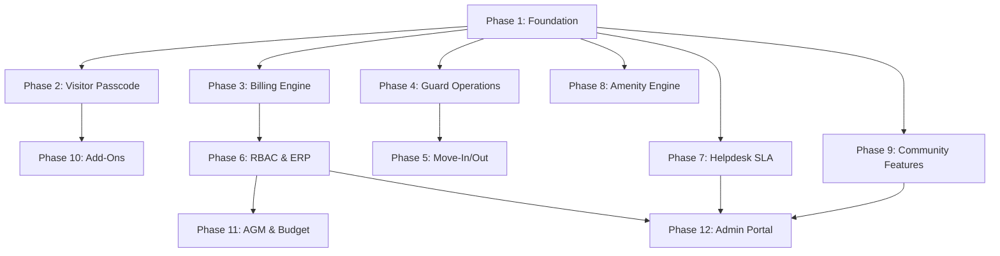

# 🏛️ LocalSampark — Complete Society Management System Implementation Plan
## MyGate + NoBrokerHood + Add-On Features — Full Integration Blueprint

---

## Resolved Design Decisions

| Question | Decision |
|----------|----------|
| **Database Driver** | **Dual-driver**: Society module uses existing SQLite `query()`/`queryOne()`/`queryMany()` from [database.sqlite.js](file:///c:/Users/Rohan/Downloads/localsampark%2007-08-2026/localsampark%2004-08-2026/backend/src/config/database.sqlite.js). E-commerce stays on Prisma/PostgreSQL. |
| **IVR / Call Fallback** | **MSG91** (Indian, cheapest at ₹0.15/call, free trial credits) as primary. **Firebase FCM** (free, unlimited) for push notifications. **WhatsApp Business API** (free 1000 conversations/month) as secondary fallback. |
| **TallyPrime** | **Both**: TDL/XML push integration for real-time sync AND CSV/Excel export for manual import. |
| **Facial Recognition** | **Both**: Google ML Kit via `react-native-vision-camera` (free, on-device face detection) AND simpler server-side photo-comparison using `face-api.js` (free, open-source). |
| **Admin Portal** | **Both**: New society tabs inside existing `apps/admin/` AND a standalone `apps/society-admin/` web app for society committee members who don't need franchise features. |

---

## Technology Additions

| Tool | Purpose | Cost |
|------|---------|------|
| **MSG91 Voice API** | IVR call fallback for visitor approval | Free trial, then ₹0.15/call |
| **Firebase FCM** | Push notifications to resident/guard | Free (unlimited) |
| **WhatsApp Business API** | Message fallback for non-smartphone users | Free (1000/month) |
| **react-native-vision-camera** | Camera + ML Kit face detection on mobile | Free (open-source) |
| **face-api.js** | Server-side face comparison/embedding | Free (open-source) |
| **PDFKit / jsPDF** | PDF receipt & invoice generation | Free (open-source) |
| **ExcelJS** | CSV/Excel export for billing & Tally | Free (open-source) |
| **node-cron** | Background job scheduling | Free (already in ecosystem) |
| **QRCode** | Dynamic QR code generation for passcodes | Free (npm package) |

---

## Complete Phase Breakdown

---

## PHASE 1 — Foundation: Re-enable Society Module & Database Upgrade
*Estimated: ~800 lines | Priority: CRITICAL — everything depends on this*

### Goal
Un-comment the disabled society routes, ensure the SQLite driver works alongside Prisma, and run the master migration that creates all new tables/columns needed for Phases 2-12.

---

### 1.1 — Re-enable Society Routes

#### [MODIFY] [backend/src/routes/index.js](file:///c:/Users/Rohan/Downloads/localsampark%2007-08-2026/localsampark%2004-08-2026/backend/src/routes/index.js)

**Current** (lines 28-47): All community routes are commented out with a 501 fallback.

**Change**: Un-comment all society routes, remove the 501 fallback, add proper error handling.

```diff
 // ─── COMMUNITY DOMAIN ─────────────────────────────────────
-/*
 router.use('/feed', apiCache(300), require('../modules/community/routes/feed.routes'));
 router.use('/chat', require('../modules/community/routes/chat.routes'));
 router.use('/societies', require('../modules/community/routes/society.routes'));
 router.use('/events', apiCache(3600), require('../modules/community/routes/event.routes'));
 router.use('/pets', require('../modules/community/routes/pet.routes'));
 router.use('/stories', require('../modules/community/routes/story.routes'));
 router.use('/society-admin', require('../modules/community/routes/society-admin.routes'));
 router.use('/townsquare', require('../modules/community/routes/townsquare.routes'));
 router.use('/scrap', require('../modules/community/routes/scrap.routes'));
 router.use('/community-hub', apiCache(300), require('../modules/community/routes/community_hub.routes'));
 router.use('/volunteer', require('../modules/community/routes/volunteer.routes'));
 router.use('/donations', require('../modules/community/routes/donations.routes'));
 router.use('/society-management', require('../modules/community/routes/society-visitor.routes'));
-*/
-
-// Safe fallback for mobile app backwards compatibility
-router.use(['/feed', '/chat', ...], (req, res) => {
-    res.status(501).json({ ... });
-});

+// NEW Phase 2-12 society routes
+router.use('/society-preapproval', require('../modules/community/routes/visitor-preapproval.routes'));
+router.use('/society-billing', require('../modules/community/routes/billing-engine.routes'));
+router.use('/society-guard', require('../modules/community/routes/guard-operations.routes'));
+router.use('/society-move', require('../modules/community/routes/move-management.routes'));
+router.use('/society-erp', require('../modules/community/routes/society-erp.routes'));
+router.use('/society-forum', require('../modules/community/routes/community-forum.routes'));
+router.use('/society-messaging', require('../modules/community/routes/private-messaging.routes'));
+router.use('/society-shifts', require('../modules/community/routes/guard-shifts.routes'));
+router.use('/society-analytics', require('../modules/community/routes/society-analytics.routes'));
```

### 1.2 — Verify SQLite Driver Compatibility

#### [MODIFY] [backend/src/config/database.sqlite.js](file:///c:/Users/Rohan/Downloads/localsampark%2007-08-2026/localsampark%2004-08-2026/backend/src/config/database.sqlite.js)
- Ensure `query()`, `queryOne()`, `queryMany()` are exported
- Add WAL mode for concurrent read/write (guard + resident hitting DB simultaneously)
- Add `withTransaction()` helper for atomic billing operations

```js
// Add to database.sqlite.js
const withTransaction = async (callback) => {
  await query('BEGIN TRANSACTION');
  try {
    const result = await callback();
    await query('COMMIT');
    return result;
  } catch (error) {
    await query('ROLLBACK');
    throw error;
  }
};
```

### 1.3 — Master Database Migration

#### [NEW] `backend/src/migrations/034_society_mega_upgrade.sqlite.sql`

This single migration creates **ALL** new tables and columns needed for every phase. Full schema (~500 lines):

**New Tables (28 tables):**

| # | Table Name | Phase | Purpose |
|---|-----------|-------|---------|
| 1 | `society_visitor_preapprovals` | 2 | Time-bound 6-digit passcodes |
| 2 | `society_ivr_logs` | 2 | IVR call tracking |
| 3 | `society_visitor_blacklist` | 2 | Blocked visitors |
| 4 | `society_billing_config` | 3 | MCS Act billing configuration |
| 5 | `society_flat_ledger` | 3 | Per-flat financial data |
| 6 | `society_charge_heads` | 3 | Itemized charge categories |
| 7 | `society_invoice_items` | 3 | Line items per invoice |
| 8 | `society_payment_receipts` | 3 | Payment receipts with PDF |
| 9 | `society_penalty_ledger` | 3 | Interest/penalty tracking |
| 10 | `society_advance_account` | 3 | Overpayment credits |
| 11 | `society_tally_exports` | 3 | Tally sync queue |
| 12 | `society_patrol_routes` | 4 | Guard patrol routes |
| 13 | `society_patrol_logs` | 4 | Patrol completion records |
| 14 | `society_gates` | 4 | Multi-gate configuration |
| 15 | `society_vehicle_log` | 4 | Vehicle entry/exit logging |
| 16 | `society_utility_deliveries` | 4 | Water tanker/diesel tracking |
| 17 | `society_police_verification` | 5 | Police verification vault |
| 18 | `society_admin_roles` | 6 | Granular RBAC roles |
| 19 | `society_vendors` | 6 | Vendor management |
| 20 | `society_vendor_invoices` | 6 | Vendor invoice tracking |
| 21 | `society_staff_payroll` | 6 | Staff payroll calculation |
| 22 | `society_assets` | 6 | Asset registry |
| 23 | `society_asset_maintenance_log` | 6 | Asset service history |
| 24 | `society_expense_categories` | 6 | Expense categorization |
| 25 | `society_complaint_activity` | 7 | Complaint state machine log |
| 26 | `society_amenity_locks` | 8 | Booking race condition locks |
| 27 | `society_messages` | 9 | Private in-app messaging |
| 28 | `society_forum_topics` | 9 | Community forum threads |
| 29 | `society_forum_replies` | 9 | Forum replies |
| 30 | `society_guard_shifts` | 10 | Guard shift scheduling |
| 31 | `society_guard_shift_swaps` | 10 | Shift swap requests |
| 32 | `society_cab_preapprovals` | 10 | Cab/ride-share entry passes |
| 33 | `society_staff_ratings` | 10 | Daily help rating system |
| 34 | `society_intercom_sessions` | 10 | Digital intercom sessions |
| 35 | `society_budget` | 11 | Annual budget planning |
| 36 | `society_budget_items` | 11 | Budget line items |
| 37 | `society_agm_meetings` | 11 | AGM/meeting management |
| 38 | `society_agm_minutes` | 11 | Meeting minutes |
| 39 | `society_document_templates` | 11 | NOC, clearance templates |
| 40 | `society_fire_safety` | 11 | Fire safety compliance |
| 41 | `society_delivery_preferences` | 11 | Per-flat delivery windows |

**New Columns on Existing Tables (30+ alterations):**

| Table | New Columns |
|-------|-------------|
| `society_visitors` | `max_stay_minutes`, `overstay_alert_sent`, `delivery_type`, `is_leave_at_gate`, `parcel_photo_url`, `gate_id`, `approval_timeout_at`, `ivr_fallback_triggered`, `passcode_used` |
| `society_staff_attendance` | `gate_id`, `face_match_score`, `check_in_photo_url` |
| `society_complaints` | `sla_hours`, `escalation_level`, `escalated_to`, `eta`, `latitude`, `longitude`, `reopened_count`, `resolution_feedback`, `resolution_comment` |
| `society_amenities` | `peak_hour_rate`, `peak_hours`, `max_bookings_per_week`, `cooldown_hours`, `cancellation_penalty`, `advance_payment_required`, `images` |
| `society_members` | `show_phone`, `show_email`, `profession`, `skills`, `bio`, `occupancy_type`, `member_since` |
| `society_polls` | `is_secret_ballot`, `eligible_voters`, `min_quorum_percent`, `result_visibility` |
| `move_passes` | `requested_by`, `clearance_status`, `outstanding_dues`, `gate_passcode`, `movers_company`, `movers_vehicle_number`, `admin_approved_at`, `admin_approved_by`, `notes` |
| `vehicles` | `vehicle_photo_url`, `is_active` |
| `society_settings` | `overstay_timeout_minutes`, `ivr_enabled`, `ivr_provider`, `whatsapp_enabled`, `multilingual_enabled`, `default_language`, `face_recognition_enabled`, `patrol_enabled`, `cab_preapproval_enabled` |

#### [NEW] `backend/src/migrations/run_034.js`
- Migration runner script

### 1.4 — Smoke Test

Verify all 40+ existing endpoints respond after un-commenting:
```bash
node backend/src/migrations/run_034.js
npm run dev:backend
# Test: GET /api/society-management/my-role → should return 401 (no token) not 501
```

---

## PHASE 2 — Advanced Visitor Management & Passcode System
*Estimated: ~2,500 lines | Priority: HIGH — Core MyGate differentiator*

### Goal
Implement the complete MyGate-grade visitor pre-approval with 6-digit passcodes, QR codes, "Leave at Gate" delivery, overstay monitoring, IVR fallback, visitor blacklist, and cab pre-approval.

---

### 2.1 — Visitor Pre-Approval System

#### [NEW] `backend/src/modules/community/controllers/visitor-preapproval.controller.js`

**Functions (~400 lines):**

| Function | Role | Description |
|----------|------|-------------|
| `createPreApproval(req, res)` | Resident | Generate 6-digit passcode + QR for expected visitor. Fields: `visitorName`, `visitorPhone`, `purpose`, `vehicleNumber`, `validFrom`, `validUntil`, `maxUses`, `leaveAtGate`. Generates passcode using `crypto.randomInt(100000, 999999)`. Creates QR using `qrcode` npm package encoding `{societyId, passcode, flatNumber}`. |
| `sharePasscode(req, res)` | Resident | Returns formatted SMS/WhatsApp share text: "You have been pre-approved to visit [Society Name]. Your gate passcode is: 123456. Show this at the security gate. Valid until [time]." |
| `verifyPasscode(req, res)` | Guard | Input: passcode or scanned QR data. Validates: not expired, not exhausted (used_count < max_uses), not revoked. On success: auto-creates visitor entry with status 'pre_approved', increments used_count. Returns resident flat details to guard. |
| `listMyPreApprovals(req, res)` | Resident | Active pre-approvals with usage stats |
| `revokePreApproval(req, res)` | Resident | Cancel before use |
| `toggleLeaveAtGate(req, res)` | Resident | Enable/disable contactless parcel drop. When enabled, guard receives "Leave at Gate" instruction — logs parcel with photo, no resident contact needed. |
| `getPreApprovalHistory(req, res)` | Admin | Analytics: pre-approvals created, used, expired |

### 2.2 — IVR & Notification Fallback System

#### [NEW] `backend/src/modules/community/services/notification-fallback.service.js`

**3-tier fallback chain (~300 lines):**

```
Step 1: Firebase FCM Push Notification (FREE, instant)
  ↓ (if no response in 60 seconds)
Step 2: WhatsApp Business API Message (FREE for 1000/month)
  ↓ (if no response in 60 seconds)  
Step 3: MSG91 Voice Call IVR (₹0.15/call)
  → "A visitor named [name] is at [gate]. Press 1 to approve, 2 to deny."
  → Webhook receives DTMF response
  → Auto-approve/deny visitor
```

| Function | Description |
|----------|-------------|
| `sendApprovalRequest(visitorId)` | Initiates the 3-tier fallback chain |
| `sendPushNotification(userId, payload)` | Firebase FCM push |
| `sendWhatsAppMessage(phone, message)` | WhatsApp Business API |
| `initiateIVRCall(phone, visitorName)` | MSG91 Voice API call |
| `handleIVRWebhook(req, res)` | Webhook: processes DTMF keypress |
| `checkApprovalTimeout()` | Called by cron — triggers next fallback tier |

#### [NEW] `backend/src/modules/community/services/msg91.service.js`
- MSG91 Voice API wrapper (~100 lines)
- `makeCall(phone, flowId)` — Initiate outbound call
- `sendSMS(phone, message)` — SMS fallback
- `getCallStatus(callId)` — Check call result

#### [NEW] `backend/src/modules/community/services/whatsapp.service.js`
- WhatsApp Business API wrapper (~80 lines)
- `sendTemplateMessage(phone, templateName, params)` — Send approved template
- `sendFreeFormMessage(phone, message)` — Send text message

### 2.3 — Overstay Monitoring

#### [NEW] `backend/src/jobs/overstay-monitor.job.js` (~100 lines)

```js
// Runs every 5 minutes via node-cron
// 1. Find all visitors with status='checked_in' AND 
//    checked_in_at + max_stay_minutes < NOW
// 2. For each overstaying visitor:
//    a. Set overstay_alert_sent = 1
//    b. Push alert to guard app (FCM)
//    c. Push alert to resident app
//    d. Log in society_visitor_log
```

### 2.4 — Visitor Blacklist

#### [NEW] Add to `visitor-preapproval.controller.js`:

| Function | Role | Description |
|----------|------|-------------|
| `blacklistVisitor(req, res)` | Admin | Add person to blacklist by name/phone. Reason required. |
| `removeFromBlacklist(req, res)` | Admin | Remove from blacklist |
| `getBlacklist(req, res)` | Admin/Guard | View all blacklisted persons |
| `checkBlacklist(phone)` | Internal | Called during visitor logging — blocks entry if match found |

### 2.5 — Cab/Ride-share Pre-Approval

#### Add to `visitor-preapproval.controller.js`:

| Function | Role | Description |
|----------|------|-------------|
| `createCabPass(req, res)` | Resident | Pre-approve Uber/Ola/auto by sharing a one-time passcode. Fields: `cabService`, `estimatedArrival`, `driverName` (optional). Auto-expires after 30 minutes. |
| `verifyCabPass(req, res)` | Guard | Validates cab passcode, auto-admits |

### 2.6 — Routes

#### [NEW] `backend/src/modules/community/routes/visitor-preapproval.routes.js` (~60 lines)

```
POST   /pre-approve              → createPreApproval (Resident)
GET    /pre-approve/share/:id    → sharePasscode (Resident)
POST   /pre-approve/verify       → verifyPasscode (Guard)
GET    /pre-approve/my            → listMyPreApprovals (Resident)
DELETE /pre-approve/:id           → revokePreApproval (Resident)
PUT    /pre-approve/leave-at-gate → toggleLeaveAtGate (Resident)
GET    /pre-approve/history       → getPreApprovalHistory (Admin)
POST   /blacklist                 → blacklistVisitor (Admin)
DELETE /blacklist/:id             → removeFromBlacklist (Admin)
GET    /blacklist                 → getBlacklist (Admin/Guard)
POST   /cab-pass                  → createCabPass (Resident)
POST   /cab-pass/verify           → verifyCabPass (Guard)
POST   /ivr/webhook               → handleIVRWebhook (Public - MSG91 callback)
```

### 2.7 — Mobile Screens

#### [NEW] `apps/mobile/app/society-resident/pre-approve.js` (~350 lines)
- Form: visitor name, phone, purpose, vehicle, valid time range
- Generate passcode button → shows 6-digit code + QR
- Share via SMS/WhatsApp button
- "Leave at Gate" toggle for deliveries
- List of active pre-approvals with revoke option

#### [NEW] `apps/mobile/app/society-guard/visitor-entry.js` (~400 lines)
- Large input field for passcode entry
- Camera button for QR scan
- Manual visitor form (name, phone, flat, purpose)
- Blacklist warning banner if match detected
- "Awaiting Approval" queue with parallel tabs
- "Leave at Gate" indicator for delivery instructions

---

## PHASE 3 — MCS Act Compliant Billing Engine
*Estimated: ~3,000 lines | Priority: HIGH — Financial backbone*

### Goal
Build a Maharashtra-compliant billing engine with bifurcated charges (service vs sinking fund), automated penalty calculation, PDF receipt generation, advance account handling, TallyPrime XML export, and CSV/Excel export.

---

### 3.1 — Billing Engine Service

#### [NEW] `backend/src/modules/community/services/billing-engine.service.js` (~600 lines)

| Function | Description |
|----------|-------------|
| `calculateServiceCharges(societyId)` | Equal split across ALL flats regardless of size (MCS Act mandate). Fetches all active charge heads with `category='service_charge'`, sums amounts, divides by total active flats. |
| `calculateSinkingFund(flatNumber, societyId)` | `(construction_cost_per_sqft × carpet_area × sinking_fund_rate%) / 12`. Fetches from `society_billing_config` and `society_flat_ledger`. |
| `calculateNOC(flatNumber, societyId)` | If `is_tenant=1`: 10% of service charges only (excludes property tax, water, sinking fund). MCS Act cap. |
| `calculateParkingCharges(flatNumber, societyId)` | Based on vehicle count × per-slot rate from `society_billing_config`. |
| `calculateLatePenalty(billId)` | Simple interest: `(principal × rate × days_overdue) / (365 × 100)`. Max 21% p.a. per MCS Act. Daily granularity. |
| `generateMonthlyInvoices(societyId, month)` | Batch generator: iterates all active members, calculates per-flat charges, creates `society_maintenance_bills` + `society_invoice_items`. Auto-applies advance balance. Sends FCM notification. |
| `applyAdvanceBalance(memberId, billId)` | Check `society_advance_account` for credits. Auto-offset against new bill. Update balance. |
| `reverseFinePenalty(billId, reason)` | Creates credit note in `society_penalty_ledger` with `is_reversed=1`. |
| `generatePDFReceipt(receiptId)` | Uses PDFKit: society letterhead, itemized charges, payment details, QR verification code. Stores URL in `receipt_pdf_url`. |
| `generateExcelExport(societyId, month)` | ExcelJS: Creates downloadable spreadsheet with all billing data, defaulter list, collection summary. |

### 3.2 — TallyPrime Integration Service

#### [NEW] `backend/src/modules/community/services/tally-integration.service.js` (~400 lines)

| Function | Description |
|----------|-------------|
| `generateJournalVoucher(invoiceData)` | Creates XML payload in TallyPrime TDL format: maps charge heads to Tally Ledger Accounts. |
| `generateSalesInvoice(invoiceData)` | XML for sales invoice with GST breakup. |
| `generateReceiptVoucher(paymentData)` | XML for payment receipt — auto-reconciles in Tally. |
| `pushToTally(xmlPayload)` | HTTP POST to TallyPrime local server (TCP bridge on port 9000). |
| `mapChargeHeadsToLedgers(chargeHeads)` | Configurable mapping: "Sinking Fund" → "Sinking Fund A/c", "Security" → "Security Charges A/c". |
| `getExportQueue(societyId)` | Returns pending Tally exports from `society_tally_exports`. |
| `exportToCSV(societyId, dateRange)` | Generates CSV compatible with Tally import format. |

### 3.3 — Billing Controller

#### [NEW] `backend/src/modules/community/controllers/billing-engine.controller.js` (~500 lines)

| Endpoint | Role | Function |
|----------|------|----------|
| `POST /config` | Admin(Treasurer) | Set billing config (construction cost, rates, GST toggle) |
| `GET /config` | Admin | Get billing configuration |
| `POST /charge-heads` | Admin(Treasurer) | Create charge head (name, category, amount, GST flag) |
| `PUT /charge-heads/:id` | Admin(Treasurer) | Update charge head |
| `GET /charge-heads` | Admin | List all charge heads |
| `POST /flat-ledger` | Admin | Set up flat financial data (area, BHK, tenant flag) |
| `PUT /flat-ledger/:flatNumber` | Admin | Update flat data |
| `POST /generate-invoices` | Admin(Treasurer) | Trigger monthly invoice generation |
| `GET /invoices` | Admin | View all invoices with filters |
| `GET /invoices/:id/items` | Admin/Resident | Get itemized breakdown |
| `GET /my-invoices` | Resident | My invoice history |
| `POST /pay/:billId` | Resident | Pay bill (UPI/card/netbanking) |
| `GET /receipt/:id` | Resident | Download PDF receipt |
| `GET /receipt/:id/pdf` | Resident | Generate & download PDF |
| `GET /defaulters` | Admin(Treasurer) | Aging report: 30/60/90 day buckets |
| `POST /reverse-penalty/:billId` | Admin(Treasurer) | Reverse fine on principal payment |
| `GET /advance-account/:flatNumber` | Admin/Resident | View advance balance |
| `POST /tally/export` | Admin(Treasurer) | Push invoices to TallyPrime |
| `GET /tally/queue` | Admin(Treasurer) | View export queue |
| `GET /export/excel` | Admin(Treasurer) | Download Excel report |
| `GET /export/csv` | Admin(Treasurer) | Download CSV for Tally import |
| `GET /financial-summary` | Admin | Dashboard: collected, pending, overdue totals |

### 3.4 — Billing Automation Jobs

#### [NEW] `backend/src/jobs/billing-automation.job.js` (~200 lines)

```js
// Cron Jobs:
// 1. Daily (midnight): Calculate interest on all overdue bills
//    → Creates entries in society_penalty_ledger
//    → Appends penalty to next invoice

// 2. Monthly (billing_day from config): Auto-generate invoices
//    → Calls billingEngine.generateMonthlyInvoices()
//    → Sends FCM notification to all residents

// 3. Reminder schedule:
//    → Due date - 5 days: "Your maintenance of ₹X is due on [date]"
//    → Due date: "Your maintenance of ₹X is due today"
//    → Due date + 5 days: "Your maintenance of ₹X is overdue"
//    → Due date + 15 days: "URGENT: ₹X overdue. Late fee accruing."
//    → Due date + 30 days: "NOTICE: ₹X overdue for 30 days."
```

### 3.5 — Routes & Mobile Screens

#### [NEW] `backend/src/modules/community/routes/billing-engine.routes.js`
- All 22 endpoints above with proper RBAC middleware

#### [NEW] `apps/mobile/app/society-resident/my-bills.js` (~400 lines)
- Itemized bill view with charge breakdown
- Payment button (integrates with existing payment gateway)
- Receipt download button
- Payment history with filters
- Advance balance display

---

## PHASE 4 — Enhanced Guard Operations
*Estimated: ~2,000 lines | Priority: HIGH*

### Goal
Guard patrolling with GPS checkpoints, multi-gate management, vehicle entry/exit with OCR, utility vehicle tracking, facial recognition for staff.

---

### 4.1 — Guard Patrol System

#### [NEW] `backend/src/modules/community/controllers/guard-patrol.controller.js` (~300 lines)

| Function | Role | Description |
|----------|------|-------------|
| `createPatrolRoute(req, res)` | Admin | Define route with named checkpoints + GPS coords. |
| `getPatrolRoutes(req, res)` | Admin/Guard | List routes for society |
| `startPatrol(req, res)` | Guard | Begin patrol session — creates `society_patrol_logs` entry |
| `scanCheckpoint(req, res)` | Guard | Submit GPS coordinates. System validates proximity (within 50m of checkpoint). Records timestamp. |
| `completePatrol(req, res)` | Guard | End patrol. Calculates missed checkpoints. |
| `getPatrolHistory(req, res)` | Admin | View all patrol logs with completion percentage |
| `getPatrolAnalytics(req, res)` | Admin | Compliance rates, missed checkpoints, average duration |

### 4.2 — Multi-Gate & Vehicle Management

#### [NEW] `backend/src/modules/community/controllers/gate-management.controller.js` (~250 lines)

| Function | Role | Description |
|----------|------|-------------|
| `configureGate(req, res)` | Admin | Create/update gates (Main, Back, Service) |
| `assignGuardToGate(req, res)` | Admin | Assign guards to specific gates for shifts |
| `logVehicleEntry(req, res)` | Guard | Log vehicle entry with optional camera capture for OCR |
| `logVehicleExit(req, res)` | Guard | Log vehicle exit |
| `lookupVehicle(req, res)` | Guard | Search by plate number → returns flat owner details (parking disputes) |
| `getVehicleLog(req, res)` | Admin | Vehicle movement history |
| `logUtilityDelivery(req, res)` | Guard | Log water tanker, diesel, LPG with challan photo, quantity, vendor |
| `getUtilityHistory(req, res)` | Admin | Utility delivery history for audit |
| `getGateDashboard(req, res)` | Admin | Real-time activity per gate |

### 4.3 — Facial Recognition for Staff

#### [NEW] `backend/src/modules/community/services/face-recognition.service.js` (~250 lines)

**Dual approach:**

**A) Mobile (Google ML Kit — free, on-device):**
- Uses `react-native-vision-camera` + `react-native-vision-camera-face-detector`
- On staff registration: capture face → detect face landmarks → extract bounding box → save cropped face image to server
- On daily check-in: capture face → compare with stored image via backend API

**B) Backend (face-api.js — free, open-source):**
```js
const faceapi = require('face-api.js');
// Functions:
// registerFace(staffId, imageBuffer) → Extract 128-dim face descriptor → store in faceid_profiles.vector_data
// compareFaces(liveImageBuffer, staffId) → Load stored descriptor → compute euclidean distance → return match score (threshold: 0.6)
// verifyStaffEntry(staffId, imageBuffer) → Compare + return {matched: true/false, score: 0.85}
```

### 4.4 — Routes & Mobile Screens

#### [NEW] `backend/src/modules/community/routes/guard-operations.routes.js`
- All patrol, gate, vehicle, utility, face-recognition endpoints

#### [NEW] `apps/mobile/app/society-guard/patrol.js` (~350 lines)
- Active patrol screen with map showing route
- Checkpoint list with scan buttons
- GPS verification indicator
- Timer and progress bar

#### [NEW] `apps/mobile/app/society-guard/vehicle-log.js` (~300 lines)
- Vehicle number input with camera for OCR
- Auto-lookup: if resident vehicle → show flat info
- Utility vehicle form: type, vendor, quantity, challan photo

---

## PHASE 5 — Move-In/Move-Out & Police Verification
*Estimated: ~1,200 lines | Priority: MEDIUM*

### Goal
Complete move workflow with financial clearance checks, police verification vault with provisional access, and automated expiry reminders.

---

### 5.1 — Move Management Controller

#### [NEW] `backend/src/modules/community/controllers/move-management.controller.js` (~400 lines)

| Function | Role | Description |
|----------|------|-------------|
| `requestMoveOut(req, res)` | Resident | Initiates move-out. System auto-checks: `SELECT SUM(total_amount - paid_amount) FROM society_maintenance_bills WHERE flat_number = ? AND payment_status != 'paid'`. If arrears > 0: status = 'blocked', returns outstanding amount. If clear: status = 'pending_approval'. |
| `approveMoveOut(req, res)` | Admin | Admin reviews, approves. Generates one-time gate passcode for movers. |
| `requestMoveIn(req, res)` | New Resident | Submit move-in request with tenant/owner details |
| `approveMoveIn(req, res)` | Admin | Approve. Sets member status to 'provisional' until police verification complete. |
| `uploadPoliceVerification(req, res)` | Resident/Admin | Upload verification certificate or acknowledgment receipt |
| `verifyPoliceDoc(req, res)` | Admin | Admin reviews document → upgrades access from 'provisional' to 'active' |
| `getExpiringVerifications(req, res)` | Admin | Dashboard: verifications expiring in 30/60/90 days |
| `getMoveRequests(req, res)` | Admin | All pending move-in/out requests |
| `generateMovePasscode(movePassId)` | Internal | Creates gate passcode for movers vehicle |

### 5.2 — Automation

#### [NEW] `backend/src/jobs/lease-expiry-reminder.job.js` (~80 lines)
- Daily cron: Check `society_flat_ledger.tenant_lease_end` and `society_police_verification.expiry_date`
- 30 days before: Alert Admin + Flat Owner + Tenant via FCM + WhatsApp

### 5.3 — Routes & Mobile Screens

#### [NEW] `backend/src/modules/community/routes/move-management.routes.js`
#### [NEW] `apps/mobile/app/society-resident/move-request.js` (~300 lines)

---

## PHASE 6 — Granular RBAC, Vendors, Payroll, Assets
*Estimated: ~2,500 lines | Priority: MEDIUM*

### Goal
Implement committee-level role-based access (Chairman, Secretary, Treasurer, Auditor, Facility Manager), vendor management, automated staff payroll, and asset registry with AMC tracking.

---

### 6.1 — Society RBAC Middleware

#### [NEW] `backend/src/modules/community/middleware/society-rbac.middleware.js` (~150 lines)

**Permission Matrix:**

| Role | Billing | Security | Members | Helpdesk | Vendors | Assets | Finance (Read) | Finance (Write) |
|------|---------|----------|---------|----------|---------|--------|----------------|-----------------|
| Chairman | ✅ | ✅ | ✅ | ✅ | ✅ | ✅ | ✅ | ✅ (approval) |
| Secretary | ❌ | ✅ | ✅ | ✅ | ❌ | ❌ | ✅ | ❌ |
| Treasurer | ✅ | ❌ | ❌ | ❌ | ✅ | ❌ | ✅ | ✅ |
| Facility Manager | ❌ | ✅ | ❌ | ✅ | ✅ | ✅ | ❌ | ❌ |
| Auditor | ❌ | ❌ | ❌ | ❌ | ❌ | ❌ | ✅ (read-only) | ❌ |

```js
const requireSocietyPermission = (permission) => async (req, res, next) => {
  const adminRole = await queryOne(
    'SELECT * FROM society_admin_roles WHERE user_id = $1 AND is_active = 1', 
    [req.user.id]
  );
  if (!adminRole) return res.status(403).json({ error: 'Society admin role required' });
  const perms = JSON.parse(adminRole.permissions);
  if (!perms[permission] && !perms.all) return res.status(403).json({ error: `Permission '${permission}' required` });
  req.societyAdminRole = adminRole;
  next();
};
```

### 6.2 — Vendor Management Controller

#### [NEW] `backend/src/modules/community/controllers/vendor-management.controller.js` (~300 lines)

| Function | Role | Description |
|----------|------|-------------|
| `createVendor(req, res)` | Admin(Treasurer) | Register vendor: name, type, contract dates, monthly cost |
| `updateVendor(req, res)` | Admin(Treasurer) | Update vendor details |
| `listVendors(req, res)` | Admin | All vendors with contract status |
| `createVendorInvoice(req, res)` | Admin(Treasurer) | Log vendor invoice with GST |
| `payVendorInvoice(req, res)` | Admin(Treasurer) | Mark invoice as paid |
| `getVendorPaymentHistory(req, res)` | Admin(Treasurer) | Payment history per vendor |
| `getExpiringContracts(req, res)` | Admin | Contracts expiring in 30/60/90 days |

### 6.3 — Staff Payroll Controller

#### [NEW] `backend/src/modules/community/controllers/staff-payroll.controller.js` (~250 lines)

| Function | Role | Description |
|----------|------|-------------|
| `generateMonthlyPayroll(req, res)` | Admin(Treasurer) | Auto-calculate: queries `society_staff_attendance` for the month, counts present days, late arrivals. Calculates: `net = base_salary × (present_days / working_days) - deductions + overtime_bonus`. |
| `getPayrollSummary(req, res)` | Admin | Monthly payroll overview |
| `approvePayroll(req, res)` | Admin(Chairman) | Approve for payment |
| `getStaffPayrollHistory(req, res)` | Admin | Individual staff payment history |

### 6.4 — Asset Registry Controller

#### [NEW] `backend/src/modules/community/controllers/asset-registry.controller.js` (~250 lines)

| Function | Role | Description |
|----------|------|-------------|
| `registerAsset(req, res)` | Admin(Facility) | Add asset: elevator, pump, generator, fire equipment |
| `updateAsset(req, res)` | Admin(Facility) | Update status, service dates |
| `logMaintenance(req, res)` | Admin(Facility) | Record service event: preventive/corrective/emergency |
| `getAssets(req, res)` | Admin | All assets with status indicators |
| `getMaintenanceSchedule(req, res)` | Admin | Upcoming services due |
| `getAMCExpiring(req, res)` | Admin | AMC contracts expiring soon |

#### [NEW] `backend/src/jobs/amc-expiry-alert.job.js` (~60 lines)
- Cron: 45 days before AMC expiry → alert admin

### 6.5 — Routes

#### [NEW] `backend/src/modules/community/routes/society-erp.routes.js`
- All vendor, payroll, asset, RBAC endpoints

---

## PHASE 7 — Enhanced Helpdesk with SLA Enforcement
*Estimated: ~800 lines | Priority: MEDIUM*

### Goal
5-state complaint machine, geo-tagged tickets, SLA timers with 3-tier auto-escalation, resolution feedback.

---

### 7.1 — Upgrade Existing Complaints

#### [MODIFY] [society-visitor.controller.js](file:///c:/Users/Rohan/Downloads/localsampark%2007-08-2026/localsampark%2004-08-2026/backend/src/modules/community/controllers/society-visitor.controller.js)

**Add new functions (~300 lines):**

| Function | Role | Description |
|----------|------|-------------|
| `reopenComplaint(req, res)` | Resident | Reopen resolved complaint with reason. Increments `reopened_count`. Creates activity log. |
| `updateComplaintStatus(req, res)` | Admin/Staff | Transition: `assigned → in_progress → resolved`. Each transition logged in `society_complaint_activity`. |
| `rateResolution(req, res)` | Resident | 1-5 star rating + comment after resolution |
| `getComplaintTimeline(req, res)` | Any Member | Full activity log for a complaint |
| `setComplaintETA(req, res)` | Admin | Set estimated resolution time. Pushes notification to resident. |

**State Machine:** `Open → Assigned → In Progress → Resolved → Reopened`

### 7.2 — Escalation Job

#### [NEW] `backend/src/jobs/complaint-escalation.job.js` (~150 lines)

```js
// Runs every 30 minutes
// For each open/assigned/in_progress complaint:
//   SLA breach at 50%: Level 1 → Alert assigned person
//   SLA breach at 75%: Level 2 → Alert Facility Manager
//   SLA breach at 100%: Level 3 → Alert Chairman + Secretary
// Each escalation: updates escalation_level, sends FCM push
```

---

## PHASE 8 — Advanced Amenity Booking Engine
*Estimated: ~600 lines | Priority: MEDIUM*

### Goal
Peak/off-peak pricing, weekly frequency limits, cool-down periods, cancellation penalties, distributed locks.

---

### 8.1 — Upgrade Existing Amenity Controller

#### [MODIFY] [society-visitor.controller.js](file:///c:/Users/Rohan/Downloads/localsampark%2007-08-2026/localsampark%2004-08-2026/backend/src/modules/community/controllers/society-visitor.controller.js)

**Modify `bookAmenity()` (~200 lines):**

```js
// Enhanced booking flow:
// 1. Check blackout dates
// 2. Check weekly frequency limit for this flat
// 3. Check cool-down period since last booking
// 4. Calculate price:
//    - If slot falls in peak_hours: use peak_hour_rate
//    - Else: use hourly_rate
// 5. Acquire distributed lock (INSERT into society_amenity_locks with TTL)
// 6. Process payment if advance_payment_required
// 7. Create booking
// 8. Release lock

// New: cancelBooking() now checks cancellation_penalty
// If cancel within 24h: charge cancellation_penalty amount
// Add to monthly maintenance invoice
```

---

## PHASE 9 — Enhanced Community Features
*Estimated: ~1,500 lines | Priority: MEDIUM*

### Goal
Privacy-controlled directory, in-app messaging, community forums, secret ballot voting, multi-language notices.

---

### 9.1 — Private Messaging

#### [NEW] `backend/src/modules/community/controllers/private-messaging.controller.js` (~200 lines)

| Function | Role | Description |
|----------|------|-------------|
| `sendMessage(req, res)` | Resident | Send message to another resident WITHOUT seeing their phone number. Routes through server. |
| `getConversations(req, res)` | Resident | List all active conversations |
| `getMessages(req, res)` | Resident | Messages in a conversation |
| `markRead(req, res)` | Resident | Mark messages as read |

### 9.2 — Community Forum

#### [NEW] `backend/src/modules/community/controllers/community-forum.controller.js` (~300 lines)

| Function | Role | Description |
|----------|------|-------------|
| `createTopic(req, res)` | Resident | Create discussion thread. Categories: General, Announcement, Discussion, Marketplace. |
| `getTopics(req, res)` | Any Member | List topics with pagination, pinned on top |
| `replyToTopic(req, res)` | Any Member | Add reply to thread |
| `likereply(req, res)` | Any Member | Like a reply |
| `pinTopic(req, res)` | Admin | Pin important thread |
| `lockTopic(req, res)` | Admin | Lock thread (no more replies) |

### 9.3 — Secret Ballot & Enhanced Polls

#### [MODIFY] Poll functions in [society-visitor.controller.js](file:///c:/Users/Rohan/Downloads/localsampark%2007-08-2026/localsampark%2004-08-2026/backend/src/modules/community/controllers/society-visitor.controller.js)

```js
// Enhanced createPoll():
// - is_secret_ballot: when true, votes stored WITHOUT voter_id
//   (use hash: SHA256(poll_id + voter_id) to prevent double-voting
//    without linking vote to person)
// - min_quorum_percent: poll result invalid if < X% participation
// - result_visibility: 'after_close' hides results until poll ends
// - eligible_voters: restrict to specific flat list (for wing-specific votes)
```

### 9.4 — Privacy-Controlled Directory

#### [MODIFY] `getDirectory()` in controller

```js
// Enhanced: Only show phone if show_phone=1
// Only show email if show_email=1
// Show profession and skills for networking
// Allow "Contact via App" button → routes to private messaging
```

### 9.5 — Routes & Mobile Screens

#### [NEW] `backend/src/modules/community/routes/community-forum.routes.js`
#### [NEW] `backend/src/modules/community/routes/private-messaging.routes.js`
#### [NEW] `apps/mobile/app/society-resident/forum.js` (~350 lines)
#### [NEW] `apps/mobile/app/society-resident/directory.js` (~300 lines)
#### [NEW] `apps/mobile/app/society-resident/polls.js` (~300 lines)

---

## PHASE 10 — Add-On Features: Guard Shifts, Cab Pass, Staff Ratings, Intercom
*Estimated: ~2,000 lines | Priority: MEDIUM*

### Goal
Guard shift management, daily help rating system, digital intercom, delivery preferences.

---

### 10.1 — Guard Shift Management

#### [NEW] `backend/src/modules/community/controllers/guard-shifts.controller.js` (~300 lines)

| Function | Role | Description |
|----------|------|-------------|
| `createShift(req, res)` | Admin | Define shift: Morning (6AM-2PM), Evening (2PM-10PM), Night (10PM-6AM) |
| `assignShift(req, res)` | Admin | Assign guard to shift + gate for date range |
| `getShiftSchedule(req, res)` | Admin/Guard | View weekly/monthly roster |
| `requestShiftSwap(req, res)` | Guard | Request to swap shift with another guard |
| `approveShiftSwap(req, res)` | Admin | Approve/deny swap request |
| `getMyShifts(req, res)` | Guard | View my upcoming shifts |
| `markShiftAttendance(req, res)` | Guard | Clock in/out for shift |
| `getOvertimeReport(req, res)` | Admin | Track overtime hours per guard |

### 10.2 — Daily Help Rating System

#### [NEW] Add to `society-visitor.controller.js` (~150 lines)

| Function | Role | Description |
|----------|------|-------------|
| `rateStaff(req, res)` | Resident | Rate maid/cook/driver (1-5 stars + comment). Only assigned flat residents can rate. |
| `getStaffRatings(req, res)` | Any Member | View community ratings for a staff member |
| `getTopRatedStaff(req, res)` | Any Member | Discover top-rated helpers in the society |
| `getStaffRatingHistory(req, res)` | Admin | Full rating history for performance reviews |

### 10.3 — Digital Intercom

#### [NEW] `backend/src/modules/community/controllers/intercom.controller.js` (~200 lines)

| Function | Role | Description |
|----------|------|-------------|
| `initiateCall(req, res)` | Guard | Guard initiates intercom call to resident. Creates session, sends push notification. |
| `respondToCall(req, res)` | Resident | Accept/decline intercom call |
| `endCall(req, res)` | Either | End intercom session, log duration |
| `getIntercomHistory(req, res)` | Admin | Call log history |

*Note: Actual voice/video uses the existing Socket.io infrastructure from [server.js](file:///c:/Users/Rohan/Downloads/localsampark%2007-08-2026/localsampark%2004-08-2026/backend/src/server.js#L52-L55)*

### 10.4 — Delivery Preferences

| Function | Role | Description |
|----------|------|-------------|
| `setDeliveryPreferences(req, res)` | Resident | Set: preferred delivery window (e.g., 10AM-12PM), "Leave at Gate" default, preferred package location |
| `getDeliveryPreferences(req, res)` | Guard | View flat's delivery preferences when logging package |

### 10.5 — Routes

#### [NEW] `backend/src/modules/community/routes/guard-shifts.routes.js`

### 10.6 — Mobile Screens

#### [NEW] `apps/mobile/app/society-guard/index.js` (~400 lines)
- Guard dashboard: Today's visitors, pending approvals, my shift info
- Active emergency alerts banner
- Quick action buttons: Log Visitor, Scan Passcode, Start Patrol

#### [NEW] `apps/mobile/app/society-guard/staff-attendance.js` (~300 lines)
- Staff list with face-verify check-in
- Today's attendance status per staff member
- History view

#### [NEW] `apps/mobile/app/society-guard/packages.js` (~250 lines)
- Pending packages list
- "Leave at Gate" indicator per flat
- Photo capture for package logging

#### [NEW] `apps/mobile/app/society-guard/emergency.js` (~200 lines)
- Active emergency alerts with alarm sound
- Flat number, resident name, emergency type
- Resolution button

---

## PHASE 11 — Add-On Features: AGM, Budget, Fire Safety, Templates
*Estimated: ~1,500 lines | Priority: LOW*

### Goal
Annual general meeting management, society budget planning, fire safety compliance tracking, document templates, multi-language notices.

---

### 11.1 — AGM & Meeting Management

#### [NEW] `backend/src/modules/community/controllers/agm-management.controller.js` (~300 lines)

| Function | Role | Description |
|----------|------|-------------|
| `scheduleMeeting(req, res)` | Admin(Secretary) | Create AGM/SGM with agenda, date, venue, quorum requirement |
| `getUpcomingMeetings(req, res)` | Any Member | View scheduled meetings |
| `recordAttendance(req, res)` | Admin | Mark member attendance at meeting |
| `addMinutes(req, res)` | Admin(Secretary) | Add meeting minutes with resolutions |
| `publishMinutes(req, res)` | Admin | Publish to all members via notice board + FCM |
| `getMeetingHistory(req, res)` | Any Member | Past meetings with minutes |

### 11.2 — Society Budget Planning

#### [NEW] `backend/src/modules/community/controllers/budget-planning.controller.js` (~250 lines)

| Function | Role | Description |
|----------|------|-------------|
| `createBudget(req, res)` | Admin(Treasurer) | Annual budget: year, total amount |
| `addBudgetItem(req, res)` | Admin(Treasurer) | Line items: Security ₹X, Housekeeping ₹Y, Maintenance ₹Z |
| `getBudget(req, res)` | Admin | Current budget with actual vs planned |
| `trackExpense(req, res)` | Admin(Treasurer) | Link expense to budget category |
| `getBudgetVariance(req, res)` | Admin | Over/under budget per category |

### 11.3 — Fire Safety Compliance

#### [NEW] Add to `asset-registry.controller.js` (~100 lines)

| Function | Role | Description |
|----------|------|-------------|
| `logFireEquipment(req, res)` | Admin(Facility) | Track: extinguishers, hydrants, alarms. Location, last inspection, next due. |
| `getFireSafetyStatus(req, res)` | Admin | Compliance dashboard: expired, due, OK counts |
| `logFireDrill(req, res)` | Admin | Record fire drill: date, participants, observations |

### 11.4 — Document Templates

#### [NEW] `backend/src/modules/community/services/document-templates.service.js` (~200 lines)

| Template | Description |
|----------|-------------|
| **NOC (No Objection Certificate)** | For tenant registration, renovation, etc. Auto-fills: society name, flat, member name, date |
| **Clearance Certificate** | Confirms no dues outstanding. Queries billing data. |
| **Move-In Approval** | Official letter with terms and conditions |
| **Move-Out Clearance** | Confirms all dues settled + handover complete |
| **Visitor Gate Pass** | Printable pass with QR code |
| **Salary Certificate** | For domestic staff |

All templates generated as PDF with society letterhead.

### 11.5 — Multi-Language Notices

**Enhancement to existing `postNotice()` function:**
- Add `language` field (default: 'en')
- Auto-translate notice title + content to Marathi and Hindi using free translation API
- Store translated versions
- Residents see notices in their preferred language setting

---

## PHASE 12 — Admin Web Portal & Society Analytics Dashboard
*Estimated: ~3,000 lines | Priority: HIGH*

### Goal
Build the complete web-based admin ERP portal — both as tabs in the existing admin app AND as a standalone society admin app. Plus a comprehensive analytics dashboard.

---

### 12.1 — New Tabs in Existing Admin App

#### [MODIFY] Existing admin app to add society tabs

| New Tab File | Description |
|-------------|-------------|
| `SocietyERPTab.js` | Main dashboard: KPIs (total dues, collected, pending, overdue), visitor count today, open complaints, patrol compliance %, active emergencies |
| `SocietyBillingTab.js` | Charge heads config, invoice generation, defaulter list with aging (30/60/90), payment collection tracker, Tally export button, Excel download |
| `SocietySecurityTab.js` | Gate-wise visitor logs, pre-approval stats, overstay reports, patrol completion heatmap, vehicle movement log |
| `SocietyHelpdeskTab.js` | All complaints with SLA indicators (green/yellow/red), escalation timeline, resolution stats, category breakdown |
| `SocietyStaffTab.js` | Staff attendance grid, payroll calculator, vendor invoices, vendor contract status |
| `SocietyAssetsTab.js` | Asset registry table, AMC status, maintenance calendar, fire safety compliance |
| `SocietyResidentsTab.js` | Member directory, flat ledger, move-in/out queue, police verification status, tenant/owner breakdown |
| `SocietyReportsTab.js` | Financial reports: P&L, Balance Sheet, Trial Balance. Tally export queue. Downloadable Excel/CSV. Budget vs Actual. |

### 12.2 — Standalone Society Admin App

#### [NEW] `apps/society-admin/` — Next.js standalone app

```
apps/society-admin/
├── src/
│   ├── app/
│   │   ├── page.js              # Login for committee members
│   │   ├── dashboard/page.js    # Main ERP dashboard
│   │   ├── billing/page.js      # Complete billing management
│   │   ├── security/page.js     # Gate & visitor management
│   │   ├── helpdesk/page.js     # Complaint tracking
│   │   ├── staff/page.js        # Staff & vendor management
│   │   ├── assets/page.js       # Asset registry
│   │   ├── residents/page.js    # Member management
│   │   ├── reports/page.js      # Financial reports
│   │   ├── meetings/page.js     # AGM management
│   │   └── settings/page.js     # Society configuration
│   ├── components/
│   │   ├── Sidebar.js
│   │   ├── StatsCard.js
│   │   ├── DataTable.js
│   │   ├── ChartWidget.js
│   │   ├── InvoiceGenerator.js
│   │   ├── PatrolMap.js
│   │   └── AgingChart.js
│   └── lib/
│       └── api.js               # API client
├── package.json
└── next.config.mjs
```

### 12.3 — Society Analytics Dashboard

#### [NEW] `backend/src/modules/community/controllers/society-analytics.controller.js` (~400 lines)

| Endpoint | Description |
|----------|-------------|
| `GET /analytics/overview` | KPIs: total flats, occupied, vacant, tenant%, collection rate |
| `GET /analytics/financial` | Monthly collection trends, outstanding breakup, top defaulters |
| `GET /analytics/security` | Daily visitor counts, peak hours, average approval time, overstay incidents |
| `GET /analytics/complaints` | Resolution rate, avg resolution time, category distribution, SLA compliance % |
| `GET /analytics/staff` | Attendance rate, top-rated staff, payroll summary |
| `GET /analytics/engagement` | Forum activity, poll participation %, event attendance, amenity utilization |
| `GET /analytics/patrol` | Patrol completion rate, missed checkpoints, guard performance |

#### [NEW] `backend/src/modules/community/routes/society-analytics.routes.js`

### 12.4 — Mobile Resident Dashboard

#### [NEW] `apps/mobile/app/society-resident/index.js` (~500 lines)
Premium dashboard with:
- **Welcome banner** with society name and flat number
- **Quick Stats**: Pending dues, upcoming visitors, packages to collect
- **Quick Actions Grid**: Pre-approve Visitor, Pay Bill, Book Amenity, Raise Complaint, SOS
- **Recent Activity Feed**: Latest visitors, payments, complaint updates
- **Notice Board Preview**: Latest 3 notices
- **My Staff Status**: Today's attendance for assigned domestic help

---

## Complete File Inventory

### Backend — New Files (38)

| # | File Path | Phase | Lines (est.) |
|---|-----------|-------|-------------|
| 1 | `migrations/034_society_mega_upgrade.sqlite.sql` | 1 | 500 |
| 2 | `migrations/run_034.js` | 1 | 30 |
| 3 | `controllers/visitor-preapproval.controller.js` | 2 | 500 |
| 4 | `services/notification-fallback.service.js` | 2 | 300 |
| 5 | `services/msg91.service.js` | 2 | 100 |
| 6 | `services/whatsapp.service.js` | 2 | 80 |
| 7 | `routes/visitor-preapproval.routes.js` | 2 | 60 |
| 8 | `jobs/overstay-monitor.job.js` | 2 | 100 |
| 9 | `services/billing-engine.service.js` | 3 | 600 |
| 10 | `services/tally-integration.service.js` | 3 | 400 |
| 11 | `controllers/billing-engine.controller.js` | 3 | 500 |
| 12 | `routes/billing-engine.routes.js` | 3 | 80 |
| 13 | `jobs/billing-automation.job.js` | 3 | 200 |
| 14 | `controllers/guard-patrol.controller.js` | 4 | 300 |
| 15 | `controllers/gate-management.controller.js` | 4 | 250 |
| 16 | `services/face-recognition.service.js` | 4 | 250 |
| 17 | `routes/guard-operations.routes.js` | 4 | 80 |
| 18 | `controllers/move-management.controller.js` | 5 | 400 |
| 19 | `routes/move-management.routes.js` | 5 | 50 |
| 20 | `jobs/lease-expiry-reminder.job.js` | 5 | 80 |
| 21 | `middleware/society-rbac.middleware.js` | 6 | 150 |
| 22 | `controllers/vendor-management.controller.js` | 6 | 300 |
| 23 | `controllers/staff-payroll.controller.js` | 6 | 250 |
| 24 | `controllers/asset-registry.controller.js` | 6 | 250 |
| 25 | `routes/society-erp.routes.js` | 6 | 100 |
| 26 | `jobs/amc-expiry-alert.job.js` | 6 | 60 |
| 27 | `jobs/complaint-escalation.job.js` | 7 | 150 |
| 28 | `controllers/community-forum.controller.js` | 9 | 300 |
| 29 | `controllers/private-messaging.controller.js` | 9 | 200 |
| 30 | `routes/community-forum.routes.js` | 9 | 50 |
| 31 | `routes/private-messaging.routes.js` | 9 | 40 |
| 32 | `controllers/guard-shifts.controller.js` | 10 | 300 |
| 33 | `controllers/intercom.controller.js` | 10 | 200 |
| 34 | `routes/guard-shifts.routes.js` | 10 | 50 |
| 35 | `controllers/agm-management.controller.js` | 11 | 300 |
| 36 | `controllers/budget-planning.controller.js` | 11 | 250 |
| 37 | `services/document-templates.service.js` | 11 | 200 |
| 38 | `controllers/society-analytics.controller.js` | 12 | 400 |
| | `routes/society-analytics.routes.js` | 12 | 50 |

### Backend — Modified Files (4)

| # | File | Phase |
|---|------|-------|
| 1 | `routes/index.js` | 1 |
| 2 | `config/database.sqlite.js` | 1 |
| 3 | `controllers/society-visitor.controller.js` | 7, 8, 9, 10 |
| 4 | `routes/society-visitor.routes.js` | 7, 8, 9, 10 |

### Mobile App — New Files (22)

| # | File Path | Phase |
|---|-----------|-------|
| 1 | `society-resident/index.js` (Dashboard) | 12 |
| 2 | `society-resident/pre-approve.js` | 2 |
| 3 | `society-resident/my-visitors.js` | 2 |
| 4 | `society-resident/my-bills.js` | 3 |
| 5 | `society-resident/amenity-booking.js` | 8 |
| 6 | `society-resident/complaints.js` | 7 |
| 7 | `society-resident/directory.js` | 9 |
| 8 | `society-resident/forum.js` | 9 |
| 9 | `society-resident/polls.js` | 9 |
| 10 | `society-resident/packages.js` | 10 |
| 11 | `society-resident/move-request.js` | 5 |
| 12 | `society-resident/emergency.js` | 10 |
| 13 | `society-guard/index.js` (Dashboard) | 10 |
| 14 | `society-guard/visitor-entry.js` | 2 |
| 15 | `society-guard/visitor-queue.js` | 2 |
| 16 | `society-guard/staff-attendance.js` | 10 |
| 17 | `society-guard/patrol.js` | 4 |
| 18 | `society-guard/vehicle-log.js` | 4 |
| 19 | `society-guard/packages.js` | 10 |
| 20 | `society-guard/utility-tracking.js` | 4 |
| 21 | `society-guard/emergency.js` | 10 |
| 22 | `society-guard/shifts.js` | 10 |

### Admin Web — New Files (12)

| # | File Path | Phase |
|---|-----------|-------|
| 1-8 | `apps/admin/src/components/tabs/Society*Tab.js` × 8 | 12 |
| 9-12 | `apps/society-admin/` (standalone app, 4 core pages) | 12 |

---

## Execution Order & Dependencies



> [!TIP]
> **Recommended execution**: Phases 1 → 2 → 3 → 4 can be done first (highest impact). Then 5 → 6 → 7 → 8 → 9 → 10 → 11 → 12.

---

## Verification Plan

### After Each Phase
```bash
# 1. Run migration
node backend/src/migrations/run_034.js

# 2. Start backend
npm run dev:backend

# 3. Run existing tests
npm run test:unit

# 4. Manual API testing via Postman
# Import localsampark.postman_collection.json and test new endpoints
```

### End-to-End Scenarios

| Scenario | Steps |
|----------|-------|
| **Visitor Pre-Approval** | Resident creates passcode → Shares via SMS → Guard enters code → Auto-approved → Check-in → Check-out |
| **Unexpected Visitor** | Guard logs visitor → Push to resident → 60s timeout → WhatsApp message → 60s → IVR call → Resident presses 1 → Guard notified → Check-in |
| **Leave at Gate** | Resident enables toggle → Delivery arrives → Guard logs parcel with photo → No resident call → Package in inventory |
| **Monthly Billing** | Admin configures charges → Cron generates invoices → Resident gets notification → Views itemized bill → Pays via UPI → PDF receipt downloaded → Tally XML pushed |
| **Complaint Resolution** | Resident files with photo → Admin assigns to plumber → Status: In Progress → 50% SLA: alert sent → Resolved → Resident rates 4/5 |
| **Guard Patrol** | Guard starts patrol → Visits 5 checkpoints → Scans each → GPS validated → Completes → Admin sees 100% compliance |
| **Move-Out** | Resident requests → System checks: ₹5,000 overdue → Request blocked → Resident pays → Re-requests → Admin approves → Gate passcode generated |

> [!IMPORTANT]
> This plan covers **72 new files** and **8 modified files** totaling approximately **18,000+ lines of code**. I recommend proceeding phase by phase. Shall I begin with **Phase 1** (Foundation) immediately?
