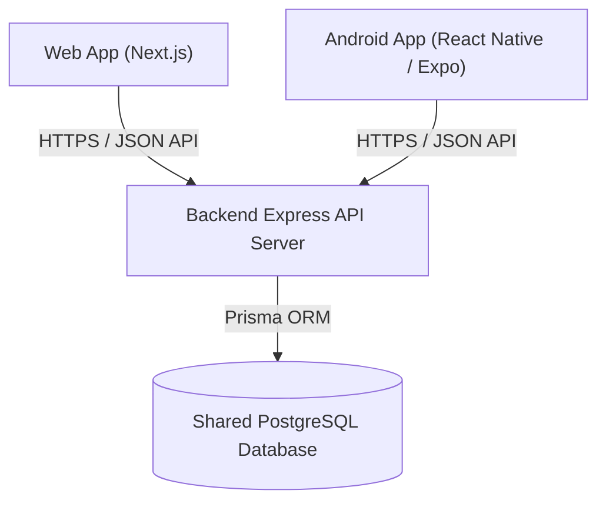
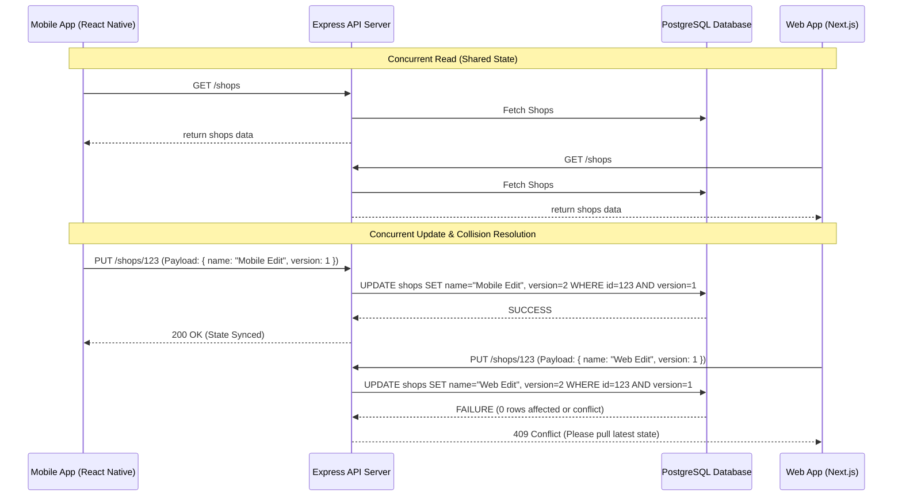
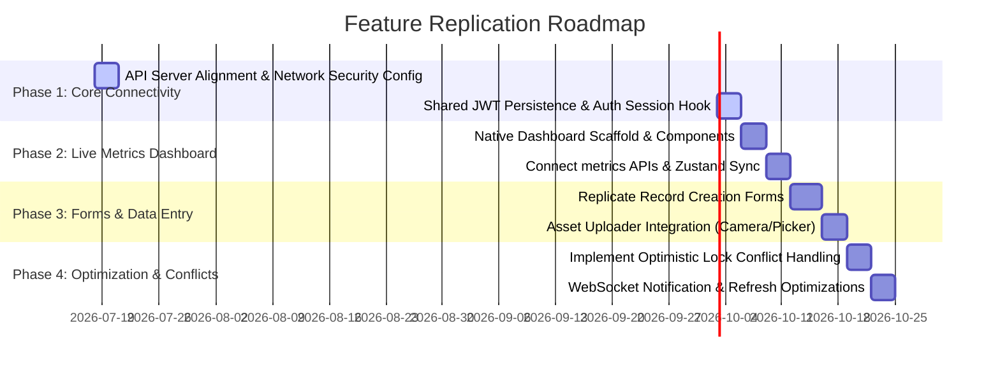

# LocalSampark: Android Mobile Migration & Database Synchronization Blueprint

This blueprint outlines the architectural design, connection strategies, and configuration files required to build a feature-for-feature Android mobile application replica using **React Native (Expo)** that connects to the same **Express API & PostgreSQL database** as the existing web application.

---

## 1. Unified Database & API Connection Architecture

To share a single live data state, both the Next.js web application and the React Native Android application must communicate with the same backend database through a unified Express API server.

### Connection Strategy Diagram



### Local Dev Server Configurations (Android Network Security)
Android blocks cleartext (HTTP) traffic by default starting from Android 9 (API Level 28). For smooth local development against your machine's IP (e.g., `192.168.1.7`) or the Android Emulator loopback (`10.0.2.2`), the following configurations are implemented:

1. **Android Resource XML (`network_security_config.xml`)**:
   - Location: [`apps/mobile/android/app/src/main/res/xml/network_security_config.xml`](file:///c:/localsampark1%2017-07-2026/localsampark1%2017-07-2026/apps/mobile/android/app/src/main/res/xml/network_security_config.xml)
   - Configuration allows HTTP traffic to designated developer subdomains and emulator loopbacks.
2. **Android Manifest Registration (`AndroidManifest.xml`)**:
   - Location: [`apps/mobile/android/app/src/main/AndroidManifest.xml`](file:///c:/localsampark1%2017-07-2026/localsampark1%2017-07-2026/apps/mobile/android/app/src/main/AndroidManifest.xml)
   - The XML configuration is linked under the `<application>` tag using `android:networkSecurityConfig="@xml/network_security_config"`.
3. **Expo Config Setup (`app.json`)**:
   - For Expo development builds or Expo Go testing, we specify `"usesCleartextTraffic": true` under the `"android"` config.

### Unified Session Persistence Pattern (Shared JWT Auth)
To ensure that a user logged in on the mobile app sees their exact account state, we unify the JWT verification logic.

1. **Token Generation**: The backend sign-in/OTP-verification endpoint (`/auth/verify-otp`) generates a signed JSON Web Token (JWT) containing the `userId`, `phone_number`, and `role`.
2. **Web Storage**: The Next.js web app stores this JWT in cookies or standard localStorage.
3. **Mobile Storage**: The mobile app stores the JWT securely using `@react-native-async-storage/async-storage` under the key `authToken`.
4. **Header Injections**: Every network request to the backend includes an `Authorization: Bearer <token>` header, verified by the Express server's authentication middleware.
5. **Token Expiration & Interceptor**: If the backend returns `401 Unauthorized` (indicating the token expired or was revoked), the mobile API client automatically wipes the stored token and user records to trigger a clean redirect to the login screen.

---

## 2. State & Data Synchronization Layer

### Centralized API Client Module
The centralized API client has been updated in [`apps/mobile/src/lib/api.js`](file:///c:/localsampark1%2017-07-2026/localsampark1%2017-07-2026/apps/mobile/src/lib/api.js) to automate request orchestration.
- **Auto-Headers**: Injects token headers on every request.
- **Structured Errors**: Maps network-level timeouts or database crashes into a catchable `ApiError` class.
- **Offline Fallbacks**: Gracefully catches failures when testing on offline local dev configurations.

### Handling Concurrent Data Updates
When multiple clients edit the database at the same time, state mismatch can occur. We implement a hybrid strategy to handle this:



1. **Optimistic Locking (Version Tracking)**:
   - Add a `version` integer column to database records.
   - When updating data, execute: `UPDATE table SET ..., version = version + 1 WHERE id = :id AND version = :current_version`.
   - If 0 rows are affected, it indicates a concurrent update occurred. The server returns a `409 Conflict`, prompting the client to refresh data.
2. **Zustand Client Cache Synchronization**:
   - The app reads data from the Zustand global store ([`apps/mobile/src/store/useAppStore.js`](file:///c:/localsampark1%2017-07-2026/localsampark1%2017-07-2026/apps/mobile/src/store/useAppStore.js)).
   - Actions in the app modify both the backend and instantly trigger a Zustand store refresh to maintain alignment.
3. **Real-time WebSockets/Supabase Broadcast**:
   - The mobile client subscribes to real-time broadcasts via Supabase or Socket.io.
   - When a user on the web dashboard updates a record, a websocket message triggers the mobile app's store to update.
   - Implementation example is pre-configured in [`apps/mobile/src/context/AuthContext.js`](file:///c:/localsampark1%2017-07-2026/localsampark1%2017-07-2026/apps/mobile/src/context/AuthContext.js#L284-L298).

---

## 3. Feature-by-Feature Replication Mapping

To translate Next.js/Tailwind web sections into React Native screens, apply the following mapping principles:

| Web Stack / Next.js | React Native Mobile Stack | Layout & Function Translation |
| :--- | :--- | :--- |
| **Grid / Flex Layouts** | Flexbox (`View` style) | All layouts in RN are flexbox-based by default. Use NativeWind `flex-row`, `items-center`, `justify-between`, or custom styling. |
| **Routing / Pages** | `expo-router` | Map `/src/app/shop/[id]/page.js` to `/app/shop/[id].js` using dynamic routing and nested layouts. |
| **State Hooks (SWR/React Query)** | `Zustand` + `useEffect` | Read store attributes for rendering; call REST queries on mount and update store. |
| **Forms (`<form>`)** | Controlled `TextInput`s | Capture inputs using `useState` and submit via REST payloads containing raw values. |

### Layout Guidelines for Key Sections

#### A. Central Dashboard & Live Metrics Summary
- **Web UI**: Large grid container with Recharts line/bar graphs and numerical summary cards.
- **Mobile Translation**:
  - Vertical `ScrollView` containing a horizontal scrollable row or a 2x2 grid of cards.
  - Implement a dashboard metrics template like the one in [`apps/mobile/src/components/DashboardNativeTemplate.js`](file:///c:/localsampark1%2017-07-2026/localsampark1%2017-07-2026/apps/mobile/src/components/DashboardNativeTemplate.js).
  - Use `react-native-chart-kit` or pure CSS-based bar indicators for chart summaries.

#### B. Data Submission Forms & Record Management
- **Web UI**: Full-screen modal or detailed inline form panels with multi-file drag-and-drop inputs.
- **Mobile Translation**:
  - A clean, vertically stacked form layout inside a card.
  - Wrap text inputs in keyboard-avoiding wrappers (`KeyboardAvoidingView`).
  - Use `expo-image-picker` to trigger native camera/gallery upload overlays instead of dropzones.

#### C. Role-Based Access Control / User Profile Management
- **Web UI**: Persistent sidebar showing different management tabs (Admin, Provider, User) matching active role permissions.
- **Mobile Translation**:
  - Implement a Floating Action Button (FAB) or account settings selector to open the `RoleSwitcher` overlay (configured in [`RoleSwitcher.js`](file:///c:/localsampark1%2017-07-2026/localsampark1%2017-07-2026/apps/mobile/src/components/RoleSwitcher.js)).
  - Guard folders via directory layouts (e.g. `(admin)` and `(tabs)`) and wrap page exports with the `withRoleGuard` HOC.

---

## 4. Base Project Folder Structure

This is the recommended mobile project folder structure to maximize modularity and logic sharing:

```
apps/mobile/
├── android/                   # Native Android build configuration (AndroidManifest.xml, res/xml, gradle)
├── ios/                       # Native iOS build configuration
├── app/                       # Expo Router application screens (File-based routing)
│   ├── (admin)/               # Route group restricted to administrators
│   ├── (tabs)/                # Main bottom-tab navigation screens (Home, Feed, Wallet, Profile)
│   ├── dashboard/             # Screen templates for active live dashboards
│   │   ├── index.js           # Existing WebView dashboard (fallback)
│   │   └── index_native.js    # New Native dashboard component screen
│   ├── _layout.js             # Root layout configuration (sets up AuthProvider and Stack Router)
│   └── login.js               # User Login Screen
├── src/                       # Central application source code
│   ├── components/            # Reusable UI components (Buttons, Cards, Modals, Forms)
│   │   ├── DashboardNativeTemplate.js  # Database connected metrics template
│   │   └── RoleSwitcher.js    # Floating profile selector based on permissions
│   ├── context/               # React Context Providers
│   │   └── AuthContext.js     # Manages active sessions, REST URLs, and real-time broadcasts
│   ├── lib/                   # Core modules and API clients
│   │   └── api.js             # Shared REST client (Fetch wrapper with headers & interceptors)
│   ├── store/                 # State management (Zustand stores)
│   │   └── useAppStore.js     # Syncs DB data like shops, wallet, and categories
│   └── utils/                 # Utility files (Permissions checker, date formats, math helpers)
└── package.json               # Package declarations and run scripts
```

---

## 5. Step-by-Step Implementation Roadmap



### Phase 1: API/Database Connectivity & Shared Auth
- Configure `network_security_config.xml` to bypass cleartext restriction.
- Connect API endpoints dynamically to check local or staging API URLs.
- Map the global `AuthContext` to persist JWT tokens correctly inside `AsyncStorage` and pass them in authorization headers.

### Phase 2: Connecting Dashboard Features
- Design native summary grids using NativeWind and display stats in clean, readable cards.
- Integrate Pull-to-Refresh via standard `RefreshControl` to instantly synchronize database records.
- Set up global Zustand store fields (`setShops`, `setWalletBalance`) to cache response data.

### Phase 3: Form/Data Action Integration
- Build mobile form inputs matching the validation schemas of the Express backend.
- Set up loading and disabling states during submissions to prevent double-posting database records.
- Trigger media uploads using native Expo libraries, sending images as base64 or multipart/form-data.

### Phase 4: Network Optimization & Conflict Handling
- Integrate error boundaries and fallback views to recover from timeout issues.
- Connect Websocket subscribers to handle concurrent changes made on the web dashboard.
- Introduce local network retry layers for critical endpoints (e.g. payments or booking state commits).
